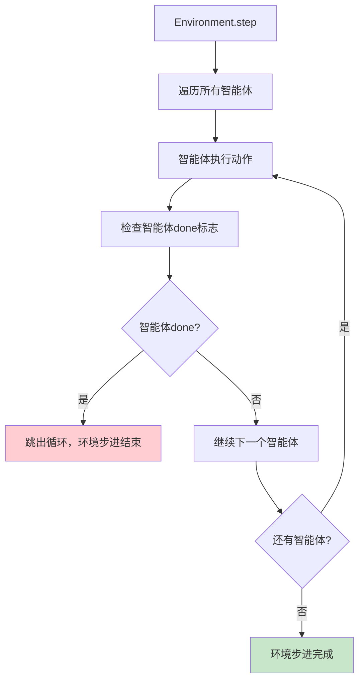

让我分析`environment.py`中的终止条件。通过查看代码，我发现环境的终止条件主要通过智能体的`done`标志来控制。

Read file: src/training/core/environment/environment.py
现在让我查看智能体中的具体终止条件：

Read file: src/training/core/agent/agent.py
基于对代码的分析，我来总结`environment.py`中的终止条件：

## Environment.py 终止条件分析

### 1. 环境层面的终止控制

在`environment.py`的`step()`方法中，环境的终止条件主要通过以下逻辑控制：

```python
# 如果有智能体完成，则停止
if done is True:
    break
```

**关键点**：环境本身不直接决定终止，而是通过监控智能体的`done`标志来决定是否停止当前步进循环。

### 2. 智能体层面的终止条件

实际的终止条件在智能体（`agent.py`）的`get_reward()`方法中定义，主要有以下几种：

#### 2.1 边界触碰终止
```python
# 边界触碰惩罚
if (((observation["position"][0] > 1) or
    (observation["position"][0] < 0) or
    (observation["position"][1] > 1) or
    (observation["position"][1] < 0)) and 
    ((np.sum(observation["ol"])/8) == 1) or (np.sum(observation["boardmask"])/8)==1):
    reward -= (self.max_steps-self.steps_done) * self.penalty_per_remaining_step
    done = True
```

**终止条件**：
- 组件位置超出PCB边界（归一化坐标 > 1 或 < 0）
- **并且** 满足以下条件之一：
  - 组件间重叠度达到最大值（`np.sum(observation["ol"])/8 == 1`）
  - 板边界重叠达到最大值（`np.sum(observation["boardmask"])/8 == 1`）

#### 2.2 最大步数终止
```python
# 达到最大步数时终止
if self.steps_done == self.max_steps:
    done = True
```

**终止条件**：智能体执行的步数达到预设的最大步数限制。

### 3. 终止条件的层次结构



### 4. 终止条件的触发时机

#### 4.1 立即终止
- **边界触碰**：当组件超出PCB边界且重叠度达到极限时
- **最大步数**：当步数计数器达到上限时

#### 4.2 环境响应
- 环境检测到任何智能体的`done=True`时，立即停止当前步进
- 环境不会等待所有智能体都完成，而是采用"一票否决"机制

### 5. 终止后的处理

#### 5.1 环境重置
```python
if self.done:
    self.train_env.reset()
    self.done = False
    self.train_env.tracker.reset()
```

#### 5.2 智能体重置
- 所有智能体状态被重置
- 位置和方向重新随机初始化
- 性能指标历史被清空

### 6. 终止条件的配置参数

| 参数 | 说明 | 影响 |
|------|------|------|
| `max_steps` | 最大步数限制 | 控制训练回合长度 |
| `penalty_per_remaining_step` | 每剩余步数惩罚值 | 影响边界触碰的惩罚强度 |
| `padding` | 绘制填充值 | 影响边界检测的精度 |

### 7. 终止条件的优化建议

1. **动态终止**：根据性能改进情况动态调整终止条件
2. **多级终止**：区分不同类型的终止，采用不同的处理策略
3. **早停机制**：当性能不再改进时提前终止
4. **约束松弛**：在训练初期使用较宽松的终止条件

### 总结

`environment.py`的终止条件采用**智能体驱动**的模式，环境本身不直接决定终止，而是通过监控智能体的状态来协调整个系统的终止行为。这种设计使得系统能够灵活响应各种终止情况，同时保持了环境与智能体之间的清晰职责分离。