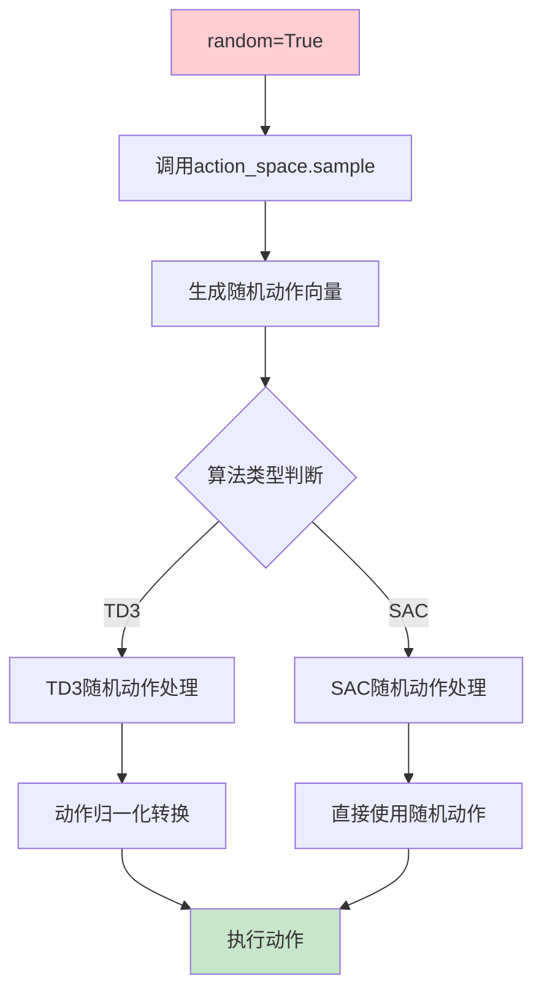
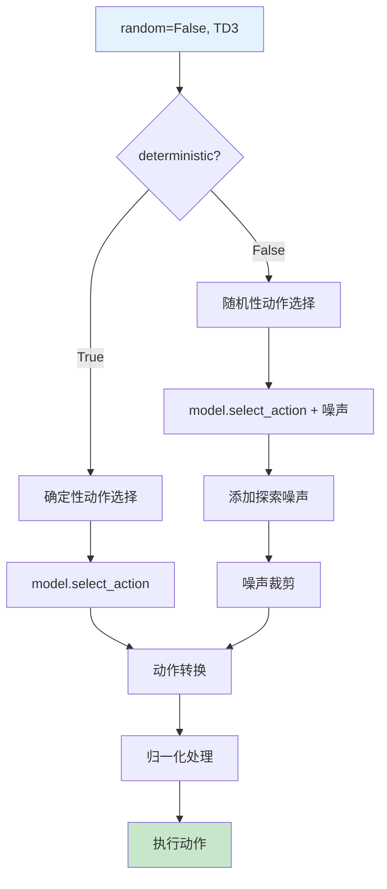
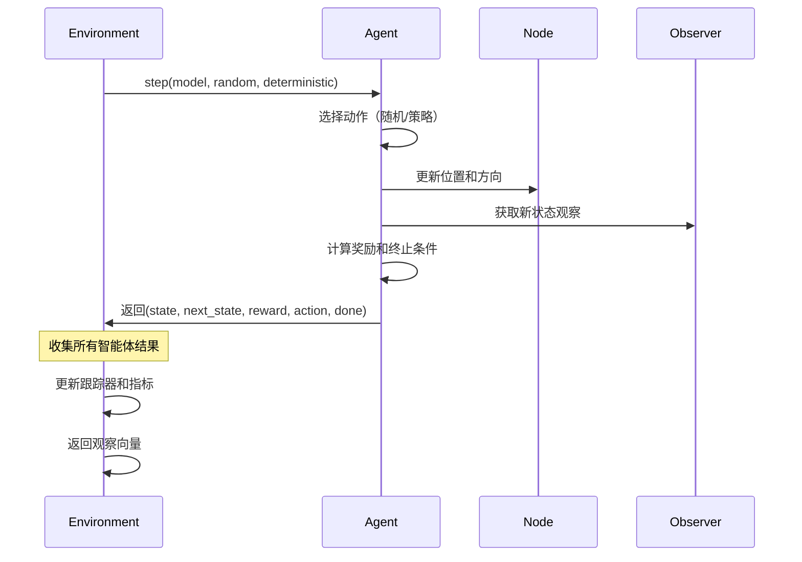

# Environment智能体单步策略交互详细分析

## 概述

本文档详细分析了`src/training/core/environment/environment.py`中`step`方法的两种工作模式：**随机探索模式**和**策略学习模式**。这两种模式在PCB布局优化训练中扮演不同角色，通过不同的动作选择策略实现智能体的行为控制。

## Step方法架构概览

### 1. 方法签名
```python
def step(self, model, random=False, deterministic:bool=False, rl_model_type:str="TD3"):
```

### 2. 参数说明
| 参数名 | 类型 | 默认值 | 说明 |
|--------|------|--------|------|
| `model` | 强化学习模型 | - | 策略网络模型对象 |
| `random` | bool | False | 是否使用随机动作 |
| `deterministic` | bool | False | 是否确定性选择动作 |
| `rl_model_type` | str | "TD3" | 强化学习算法类型 |

### 3. 返回值
```python
observation_vec: 所有智能体的观察向量列表
```

## 两种模式详解

### 模式1：随机探索模式 (random=True)

#### 1.1 触发条件
```python
if random is True:
    # 随机动作选择逻辑
```

#### 1.2 动作选择过程



#### 1.3 TD3随机动作处理
```python
if rl_model_type == "TD3":
    model_action = [0,0,0]
    model_action[0] = (action[0] - 0.5) * 2      # 步长归一化: [0,1] -> [-1,1]
    model_action[1] = (action[1] - np.pi) / np.pi # 角度归一化: [0,2π] -> [-1,1]
    model_action[2] = (action[2] - 0.5) * 2      # 方向归一化: [0,1] -> [-1,1]
```

**归一化公式解析**：
- **步长**: `(x - 0.5) * 2` 将[0,1]映射到[-1,1]
- **角度**: `(θ - π) / π` 将[0,2π]映射到[-1,1]
- **方向**: `(d - 0.5) * 2` 将[0,1]映射到[-1,1]

#### 1.4 使用场景
- **训练前探索**：收集专家目标数据
- **策略验证**：测试环境交互逻辑
- **调试分析**：检查系统稳定性

### 模式2：策略学习模式 (random=False)

#### 2.1 触发条件
```python
else:  # random=False
    if rl_model_type == "TD3":
        # TD3策略学习逻辑
    else:  # SAC
        # SAC策略学习逻辑
```

#### 2.2 TD3策略学习流程



#### 2.3 TD3动作选择详解

##### 2.3.1 确定性选择
```python
if deterministic is True:
    model_action = model.select_action(np.array(_state))
```

**特点**：
- 直接使用策略网络输出
- 无随机性，适合评估和推理
- 动作值稳定可预测

##### 2.3.2 随机性选择
```python
else:
    # 添加探索噪声
    model_action = (model.select_action(np.array(_state)) + 
                  np.random.normal(0, self.parameters.max_action * self.parameters.expl_noise, size=3)).clip(-self.parameters.max_action, self.parameters.max_action)
```

**噪声机制解析**：
- **噪声分布**: `np.random.normal(0, σ, size=3)`
- **噪声强度**: `σ = max_action * expl_noise`
- **噪声裁剪**: `.clip(-max_action, max_action)`

**参数说明**：
- `max_action`: 最大动作值限制
- `expl_noise`: 探索噪声系数
- `size=3`: 对应[步长, 角度, 方向]三个动作维度

#### 2.4 SAC策略学习流程

```python
else:  # SAC算法
    action = model.select_action(np.array(_state), evaluate=deterministic)
```

**特点**：
- SAC内部处理动作缩放
- `evaluate`参数控制确定性/随机性
- 动作空间管理更灵活

## 动作执行与状态更新

### 1. 动作执行过程

```python
# 执行动作：更新组件位置和方向
pos = self.parameters.node.get_pos()
step_scale = (self.parameters.step_size * action[0])  # 计算步长
x_offset = step_scale * np.cos(-action[1])           # X方向偏移
y_offset = step_scale * np.sin(-action[1])           # Y方向偏移
angle = (np.int0(action[2] * 4) % 4) * 90.0        # 方向角度（0°, 90°, 180°, 270°）
```

#### 1.1 位置更新计算

**步长计算**：
```
step_scale = step_size × action[0]
```
- `step_size`: 基础步长（通常为板尺寸的5%）
- `action[0]`: 归一化步长系数[0,1]

**坐标偏移**：
```
x_offset = step_scale × cos(-action[1])
y_offset = step_scale × sin(-action[1])
```
- `action[1]`: 移动角度[0, 2π]
- 负号表示坐标系转换

**新位置**：
```python
new_pos = (pos[0] + x_offset, pos[1] + y_offset)
```

#### 1.2 方向更新计算

```python
angle = (np.int0(action[2] * 4) % 4) * 90.0
```

**计算过程**：
1. `action[2] * 4`: 将[0,1]映射到[0,4]
2. `np.int0()`: 取整数部分
3. `% 4`: 取模运算，确保范围[0,3]
4. `* 90.0`: 转换为角度值

**结果映射**：
- 0 → 0°
- 1 → 90°
- 2 → 180°
- 3 → 270°

### 2. 状态更新流程



## 智能体协调机制

### 1. 执行顺序控制

```python
# 智能体执行顺序（可随机打乱）
idxs = []
for i in range(len(self.agents)):
    idxs.append(i)

if self.parameters.shuffle_idxs is True:
    random_package.shuffle(idxs)
```

**机制说明**：
- **顺序执行**: 按智能体索引顺序执行
- **随机执行**: 随机打乱执行顺序，增加训练多样性
- **配置控制**: 通过`shuffle_idxs`参数控制

### 2. 早期终止机制

```python
# 如果有智能体完成，则停止
if done is True:
    break
```

**设计原理**：
- **一票否决**: 任何智能体终止都会结束当前步进
- **资源优化**: 避免无效计算
- **状态一致性**: 确保环境状态同步

## 数据收集与监控

### 1. 观察向量构建

```python
# 转换状态向量格式
_state = list(state["los"]) + list(state["ol"]) + state["dom"] + state["euc_dist"] + state["position"] + state["ortientation"] + list(state["boardmask"])
_next_state = list(next_state["los"]) + list(next_state["ol"]) + next_state["dom"] + next_state["euc_dist"] + next_state["position"] + next_state["ortientation"] + list(next_state["boardmask"])
```

**状态向量结构**：
```
_state = [
    los[8],        # 8个方向的视线信息
    ol[8],         # 8个方向的重叠度
    dom[2],        # 距离向量
    euc_dist[2],   # 欧几里得距离和角度
    position[2],   # 位置坐标
    orientation[1], # 方向角度
    boardmask[8]   # 板边界掩码
]
```

**总维度**: 8+8+2+2+2+1+8 = 31维

### 2. 性能指标记录

```python
step_metrics.append({
    "id": self.agents[i].parameters.node.get_id(),
    "name": self.agents[i].parameters.node.get_name(),
    "reward": reward,
    "W": self.agents[i].all_w[-1],           # 归一化线长
    "We": self.agents[i].We,                  # 目标线长
    "HPWL": self.agents[i].all_hpwl[-1],     # 归一化HPWL
    "HPWLe": self.agents[i].HPWLe,           # 目标HPWL
    "ol": 1-self.agents[i].ol_term5[-1],     # 重叠度
    "weighted_cost": self.agents[i].all_weighted_cost[-1],  # 加权成本
    "raw_W": self.agents[i].W[-1],           # 原始线长
    "raw_HPWL": self.agents[i].HPWL[-1],     # 原始HPWL
    "Wi": self.agents[i].Wi,                 # 初始线长
    "HPWLi": self.agents[i].HPWLi            # 初始HPWL
})
```

## 调试与可视化

### 1. 调试模式支持

```python
# 调试模式下的可视化更新
if self.parameters.debug is True:
    # 绘制组件网格
    comp_grids = draw_board_from_board_and_graph_with_debug(
        self.b, self.g, padding=self.padding)
    
    # 更新飞线图
    # ... 飞线图绘制逻辑
    
    self.tracker.add(comp_grids=comp_grids, ratsnest=ratsnest)
```

### 2. 可视化组件

- **组件网格**: 显示PCB布局状态
- **飞线图**: 显示网络连接关系
- **实时更新**: 每步都更新可视化内容

## 性能优化策略

### 1. 计算效率优化

- **向量化操作**: 使用numpy进行批量计算
- **条件分支**: 减少不必要的计算
- **内存管理**: 及时释放临时变量

### 2. 并行化潜力

```python
# 潜在的并行化改进
def parallel_step(self, model, random=False, deterministic=False, rl_model_type="TD3"):
    """并行执行所有智能体的动作"""
    from concurrent.futures import ThreadPoolExecutor
    
    with ThreadPoolExecutor(max_workers=len(self.agents)) as executor:
        futures = [
            executor.submit(self.agents[i].step, model, random, deterministic, rl_model_type)
            for i in range(len(self.agents))
        ]
        
        results = [future.result() for future in futures]
        return self.process_results(results)
```

## 错误处理与容错

### 1. 异常处理机制

- **动作验证**: 检查动作值是否在有效范围内
- **状态检查**: 验证状态转换的合理性
- **资源保护**: 防止内存泄漏和资源耗尽

### 2. 恢复策略

- **状态回滚**: 动作执行失败时回滚到前一个状态
- **智能体重置**: 异常情况下重置智能体状态
- **日志记录**: 详细记录错误信息用于调试

## 总结

Environment的step方法通过两种模式实现了灵活而强大的智能体控制：

### 模式1：随机探索模式
- **目的**: 数据收集、环境验证、调试分析
- **特点**: 完全随机，无策略依赖
- **适用**: 训练初期、系统验证、性能基准

### 模式2：策略学习模式
- **目的**: 强化学习训练、策略优化
- **特点**: 基于策略网络，支持探索与利用
- **适用**: 正式训练、策略评估、性能优化

### 核心优势
1. **灵活性**: 支持多种训练策略
2. **可扩展性**: 易于添加新的算法支持
3. **监控性**: 全面的性能指标收集
4. **调试性**: 丰富的可视化支持

这种设计为PCB布局优化提供了强大而灵活的训练框架，能够适应不同的训练阶段和需求。
