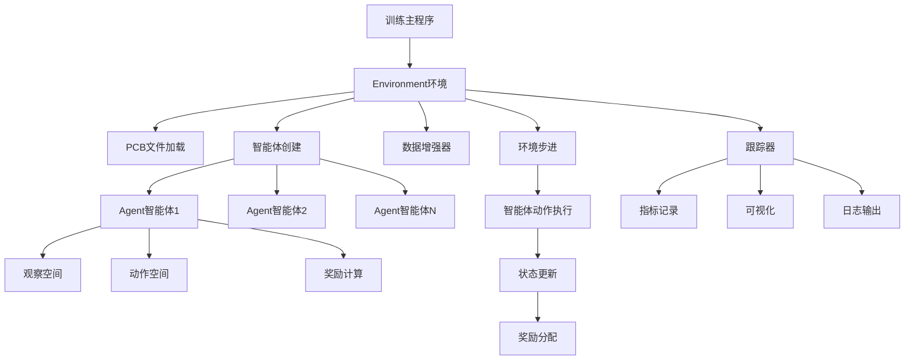
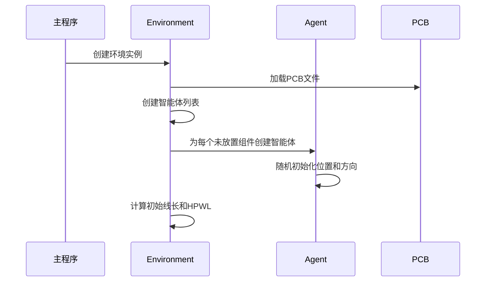
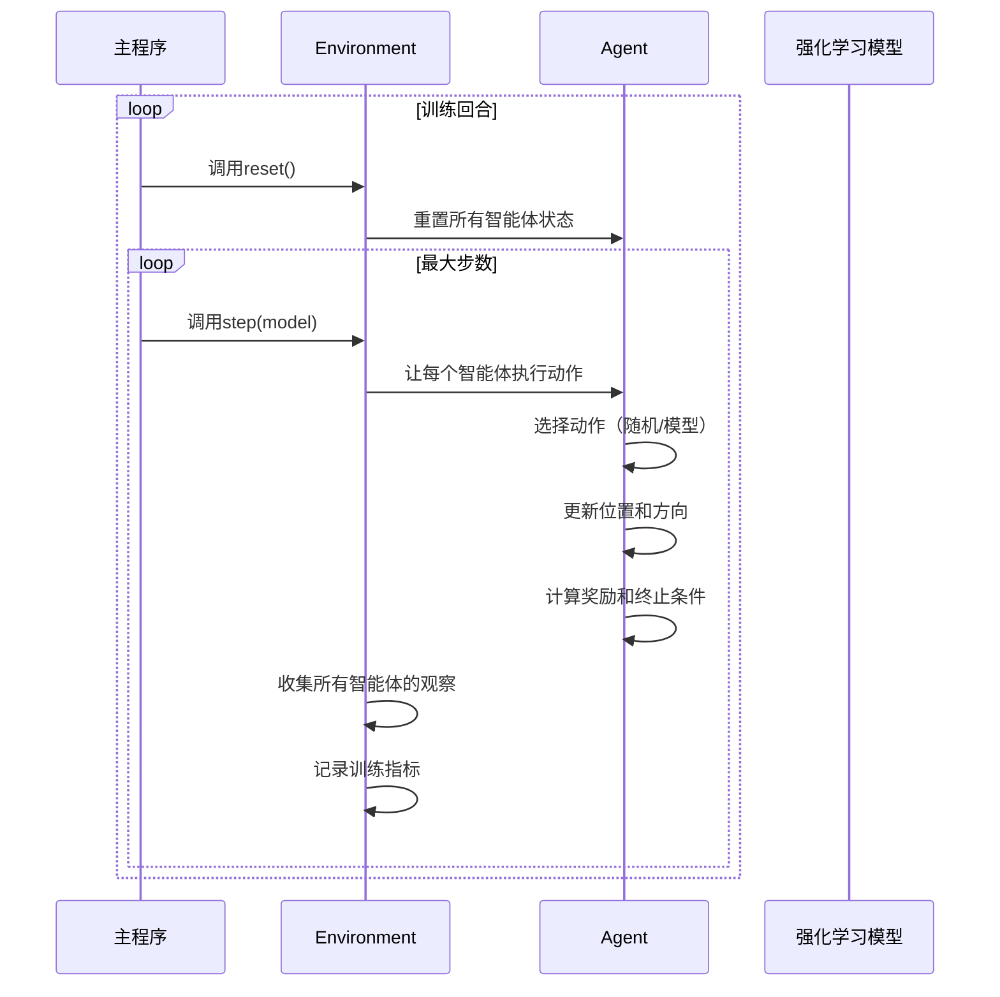
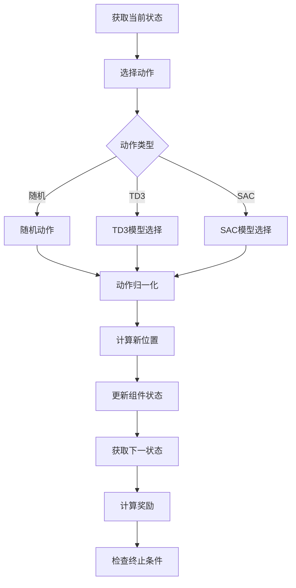

# PCB强化学习训练架构分析

## 概述

本文档分析了基于强化学习的PCB布局优化系统中智能体（Agent）和环境（Environment）的架构设计、功能实现以及在训练过程中的调用关系。该系统采用多智能体强化学习框架，通过TD3或SAC算法优化电子组件的布局位置和方向。

## 系统架构



## 核心组件分析

### 1. Environment（环境类）

#### 主要功能
- **PCB管理**：加载和管理PCB文件，支持多个PCB布局的训练
- **智能体协调**：创建、管理和协调多个智能体的行为
- **数据增强**：通过平移和旋转增强训练数据
- **训练接口**：提供标准的强化学习环境接口（reset, step等）

#### 关键方法
```python
def __init__(self, parameters):
    # 初始化PCB环境，加载文件，创建智能体
    
def reset(self):
    # 重置环境状态，开始新的训练回合
    
def step(self, model, random=False, deterministic=False, rl_model_type="TD3"):
    # 执行环境步进，让所有智能体执行动作
    
def initialize_environment_state_from_pcb(self, init=False, idx=-1):
    # 从PCB文件初始化环境状态，创建智能体
```

#### 智能体创建流程
1. 读取PCB文件，获取网络图和板信息
2. 识别未放置的电子组件
3. 为每个未放置组件创建对应的智能体
4. 配置智能体参数（位置、邻居、网络连接等）

### 2. Agent（智能体类）

#### 主要功能
- **状态观察**：获取8个方向的视线、重叠度、距离向量等信息
- **动作执行**：控制组件的移动（位置、方向、角度）
- **奖励计算**：基于线长、HPWL、重叠度等指标计算奖励
- **学习优化**：通过强化学习算法优化布局策略

#### 观察空间
```python
obs_space = {
    "los": spaces.Box(shape=(8,)),      # 8个方向的视线信息
    "ol": spaces.Box(shape=(8,)),       # 8个方向的重叠度
    "dom": spaces.Box(shape=(2,)),      # 距离向量
    "euc_dist": spaces.Box(shape=(2,)), # 欧几里得距离和角度
    "position": spaces.Box(shape=(2,)), # 当前位置坐标
    "ortientation": spaces.Box(shape=(1,)), # 当前方向
    "boardmask": spaces.Box(shape=(8,)) # 板边界掩码
}
```

#### 动作空间
```python
action_space = spaces.Box(
    low=np.array([0, 0, 0]),
    high=np.array([1, 2*np.pi, 1])
)
# 动作含义：[步长, 角度, 方向]
```

#### 奖励函数
```python
# 多目标优化奖励函数
reward = np.tan((n*x + m*ol_term5 + p*y + m*ol_board)/(n+2*m+p) * np.pi/2.1)

# 其中：
# x: 归一化线长改进
# y: 归一化HPWL改进  
# ol_term5: 组件重叠度
# ol_board: 板边界重叠度
# n, m, p: 权重参数
```

## 训练流程分析

### 1. 初始化阶段


### 2. 训练循环


### 3. 智能体动作执行流程


## 关键特性分析

### 1. 多智能体协作
- 每个未放置的电子组件对应一个智能体
- 智能体之间通过共享PCB状态进行协作
- 支持随机打乱智能体执行顺序，增加训练多样性

### 2. 多目标优化
- **线长优化**：最小化组件间的欧几里得距离
- **HPWL优化**：最小化半周长线长
- **重叠避免**：避免组件间和板边界的重叠
- **边界约束**：确保组件不超出PCB边界

### 3. 数据增强策略
- **位置增强**：在合理范围内随机平移组件
- **方向增强**：随机旋转组件方向
- **约束条件**：保持LOCKED组件居中，确保布局合理性

### 4. 观察空间设计
- **8方向感知**：提供全方位的环境感知能力
- **多模态信息**：结合视觉、几何和拓扑信息
- **归一化处理**：确保不同量纲数据的兼容性

## 训练参数配置

### 环境参数
```python
# 奖励函数权重
n = params["w"]      # 线长权重
m = params["o"]      # 重叠度权重  
p = params["hpwl"]   # HPWL权重

# 训练控制
max_steps = params["max_steps"]           # 最大步数
use_dataAugmenter = params["use_dataAugmenter"]  # 数据增强
shuffle_idxs = params["shuffle_idxs"]     # 智能体执行顺序随机化
```

### 智能体参数
```python
# 动作控制
step_size = min(board_width, board_height) * 0.05  # 步长大小
max_action = params["max_action"]          # 最大动作值
expl_noise = params["expl_noise"]          # 探索噪声

# 优化目标
opt_euclidean_distance = node.get_opt_euclidean_distance()  # 目标线长
opt_hpwl = node.get_opt_hpwl()                             # 目标HPWL
```

## 性能监控与分析

### 1. 训练指标
- **线长改进**：归一化和原始线长的变化趋势
- **HPWL改进**：半周长线长的优化过程
- **重叠度**：组件间重叠的减少情况
- **加权成本**：综合优化目标的收敛情况

### 2. 可视化功能
- **实时视频**：训练过程的动态可视化
- **指标图表**：各种性能指标的趋势分析
- **快照捕获**：关键状态的静态图像记录
- **日志记录**：详细的训练过程日志

### 3. 调试支持
- **组件网格**：PCB布局的网格化表示
- **飞线图**：网络连接的图形化显示
- **重叠检测**：实时重叠状态监控
- **边界检查**：组件边界约束验证

## 应用场景与优势

### 1. 适用场景
- **PCB布局优化**：电子组件的自动布局设计
- **布线优化**：网络连接的路径优化
- **设计验证**：布局合理性的自动检查
- **设计迭代**：快速布局方案生成和评估

### 2. 技术优势
- **多目标优化**：同时考虑多个设计约束
- **自适应学习**：通过强化学习自动优化策略
- **可扩展性**：支持不同规模和复杂度的PCB设计
- **实时反馈**：训练过程中的即时性能评估

### 3. 工程价值
- **设计效率**：自动化布局设计，减少人工干预
- **质量提升**：基于多目标的优化设计
- **成本降低**：减少设计迭代和验证时间
- **知识积累**：训练好的模型可复用和迁移

## 总结

该PCB强化学习训练系统通过精心设计的智能体-环境架构，实现了电子组件布局的自动化优化。系统采用多智能体协作、多目标优化、数据增强等先进技术，为PCB设计领域提供了创新的解决方案。通过强化学习算法，系统能够学习复杂的布局策略，在满足多种设计约束的同时，实现布局质量的持续改进。
