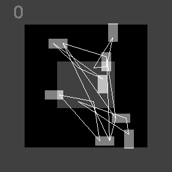
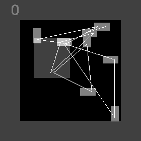
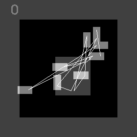
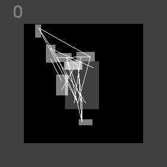
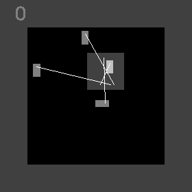
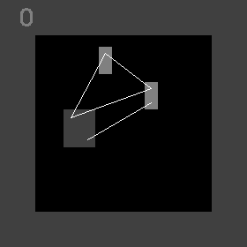

# GPT-Academic Report
## 翻译 private_upload\default_user\2025-04-21-21-21-57\README.md.part-0.md

[toc]

# 项目描述

RL_PCB是一种端到端的强化学习PCB布局方法。该方案灵感来源于细胞自动机。电路布局问题的状态分布在布局区域的所有组件上。每个组件都能基于局部和全局信息独立更新其位置。如何结合经验（即历史知识）来更新状态是一个特别棘手的问题。我们利用强化学习来学习状态更新的策略。我们的方法确保局部更新不会破坏全局解决方案。因此，解决方案自然作为系统的涌现属性呈现。

您可以通过阅读我们的[DATE 24论文](https://ieeexplore.ieee.org/document/10546526)了解更多关于这项工作的信息。我的[硕士论文](https://www.lukevassallo.com/wp-content/uploads/2023/09/automated_pcb_component_placement_using_rl_msc_thesis_v2_1_lv.pdf)研究了Mirhoseini等人提出的“快速芯片设计的图布局方法”，并基于其不足提出了本方案。

如果您觉得这项工作有用，请引用我们！
```bibtex
@inproceedings{Vassallo2024,
  author={Vassallo, Luke and Bajada, Josef},
  booktitle={2024 Design, Automation & Test in Europe Conference & Exhibition (DATE)}, 
  title={Learning Circuit Placement Techniques Through Reinforcement Learning with Adaptive Rewards}, 
  year={2024},
  volume={},
  number={},
  pages={1-6},
}
```

RL_PCB是一种新颖的基于学习的方法，用于优化印刷电路板（PCB）上电路组件的布局。通过强化学习，该方法学习迭代改进电路布局的通用策略，不仅生成直观的布局，还在布线后线长方面优于随机方法。

# 关键成果

本工作的主要贡献包括：
1. 策略学习任务的基本规则，并展现出对问题动态的理解。观察到智能体采取**长期**减少无重叠线长的行动。同时，组件自然地各归其位，形成协调的布局。
2. 由于智能体代表一个组件，通过每个组件与邻居的交互，观察到涌现行为。当奖励函数强调半周长线长（HPWL）时，观察到协作行为（如图1c、1d）；反之，当强调欧几里得线长（EW）时，则观察到竞争行为（如图1b）。
3. 学习到的行为具有鲁棒性，因为训练数据多样且与评估反馈一致。通过广泛归一化和消除所有潜在偏差源实现一致性。奖励机制同样如此。多样性通过让每个智能体以不同视角贡献训练样本获得，并进一步通过使用多个独特电路进行训练来增强——仅用6个电路的小型训练数据集。

|     |     |     |
| --- | --- | --- |
|  <br />(a) (EW=0, HPWL=5, 重叠=5) |  <br />(b) (EW=8, HPWL=0, 重叠=2) |  <br />(c) (EW=0, HPWL=8, 重叠=2) |
|  <br />(d) (EW=0, HPWL=8, 重叠=2) |  <br />(e) (EW=8, HPWL=0, 重叠=2)|  <br />(f) (EW=8, HPWL=0, 重叠=2) |
|  <br />(g) (EW=8, HPWL=0, 重叠=2) |  <br />(h) (EW=2, HPWL=2, 重叠=6) |   <br />(i) (EW=2, HPWL=2, 重叠=6) |

## 翻译 private_upload\default_user\2025-04-21-21-21-57\README.md.part-1.md

**图1**：成功优化训练过程中未见过的电路策略。

# 安装指南
**非常重要：执行安装步骤时，需确保位于仓库根目录下（即与脚本install_tools_and_virtual_environment.sh同一位置）**

## 安装前置依赖
系统需安装以下软件包以编译用于解析KiCAD PCB文件（.kicad_pcb）的库及布局布线工具。
```
sudo apt install python3-virtualenv build-essential libboost-dev libboost-filesystem-dev
```

为保证一致性，Python代码需使用3.8版本。此外，Python虚拟环境用于在限定范围内安装依赖项，避免对系统配置造成更改。若系统包管理器未默认提供Python3.8，可通过以下代码添加维护历史版本的apt仓库并获取对应版本：
```
sudo add-apt-repository ppa:deadsnakes/ppa -y
sudo apt update
sudo apt install python3.8 python3.8-venv
```

## 运行自动化安装脚本
自动化安装流程将对本地仓库进行以下变更：
- 创建bin目录并安装KiCad解析工具及布局布线工具
- 使用python3.8创建环境，安装CUDA 11.7支持的PyTorch 1.13及所有必要Python包
- 在lib文件夹中安装wheel库

```
./install_tools_and_virtual_environment.sh --env_only
```

若未安装CUDA 11.7，可选择仅安装CPU版本。测试与实验运行速度将显著降低，但无需额外配置即可使用：
```
./install_tools_and_virtual_environment.sh --cpu_only
```

如需使用其他CUDA版本，请修改以下内容后不带参数运行`install_tools_and_virtual_environment.sh`：
- 在`setup.sh`脚本中，将CUDA路径指向您的CUDA安装目录
- 在`install_tools_and_virtual_environment.sh`脚本中，更换PyTorch库以匹配您的CUDA版本

使用CPU设备或替代CUDA版本将导致测试和实验结果与附带的PDF报告存在差异。

# 运行测试与实验
执行任何测试或实验前，请务必先加载环境设置脚本。**脚本需从仓库根目录运行**
```
cd <path-to-rl_pcb>
source setup.sh 
```

运行实验：
```
cd experiments/00_parameter_exeperiments
./run.sh    
```

运行测试——测试用于验证源代码的正确性，会在持续集成(CI)环境中定期执行：
```
cd tests/01_training_td3_cpu
./run.sh
```

`run.sh`脚本将执行以下操作：
1. 根据同目录下`run_config.txt`的指令完成训练运行
2. 生成实验报告处理实验数据，通过表格和图表展示结果。所有实验元数据均会记录，可通过同目录下的`report_config.py`进行自定义
3. 评估所有策略及模拟退火基线。所有优化后的布局将使用基于A*的算法进行布线
4. 生成报告处理评估数据，汇总HPWL和布线长度指标。所有实验元数据均会记录

可通过以下命令清理生成的文件：
```
./clean.sh
```

每个测试和实验均包含名为`expected results`的目录，内含预生成报告。若按原样运行实验，预期将获得相同结果。

# GPU设置（可选）
本节提供可选设置流程，用于卸载Nvidia GPU驱动及所有依赖库并进行全新安装。**本节命令将大幅改动系统，执行前请仔细阅读** 部分命令需根据实际情况调整。

1. 卸载已安装的CUDA：`sudo apt-get --purge remove cuda* *cublas* *cufft* *curand* *cusolver* *cusparse* *npp* *nvjpeg* *nsight*`
2. 检查驱动是否安装，若存在则卸载：`sudo apt-get --purge remove *nvidia*`
3. 卸载cuddnn：`sudo apt remove libcudnn* libcudnn*-dev`

## 翻译 private_upload\default_user\2025-04-21-21-21-57\README.md.part-2.md

### 安装NVIDIA显卡驱动  
要安装驱动程序，可先执行命令`ubuntu-drivers devices`，识别出最新的第三方非免费版本。确定合适版本后，使用`apt`进行安装。安装完成后重启系统，并执行`nvidia-smi`命令查看完整的驱动版本号。在后续步骤中，需根据此信息确定支持的CUDA版本。

### 下载并安装CUDA工具包  
为确保设备驱动与CUDA兼容，需通过以下链接核对兼容性：https://docs.nvidia.com/deploy/cuda-compatibility/。确认兼容后，访问CUDA工具包归档页面：https://developer.nvidia.com/cuda-toolkit-archive，选择11.7版本，并从"Select Target Platform"部分选取对应平台参数。接着下载runfile（本地文件）并执行安装流程。注意在安装提示出现时跳过驱动安装步骤。

```
wget https://developer.download.nvidia.com/compute/cuda/11.7.1/local_installers/cuda_11.7.1_515.65.01_linux.run
sudo sh cuda_11.7.1_515.65.01_linux.run
```

按需更新setup.sh脚本。`PATH`和`LD_LIBRARY_PATH`的默认配置为：

```
export PATH="/usr/local/cuda-11.7/bin:$PATH"
export LD_LIBRARY_PATH="/usr/local/cuda-11.7/lib64:$LD_LIBRARY_PATH"
```

# 本项目依据MIT许可证条款授权  
MIT许可证  

版权所有 (c) 2023 Luke Vassallo  

特此免费授予任何获得本软件及相关文档文件（"软件"）副本的人士不受限制地处理本软件的权限，包括但不限于使用、复制、修改、合并、发布、分发、再授权及/或出售本软件副本的权利，并允许被提供本软件的人士在上述条件下使用本软件，但须符合以下条件：  

上述版权声明及本许可声明须包含在本软件的所有副本或主要部分中。  

本软件按"原样"提供，不附带任何明示或暗示的担保，包括但不限于适销性、特定用途适用性和非侵权担保。在任何情况下，作者或版权持有人均不对因本软件或使用本软件而产生的任何索赔、损害或其他责任承担责任，无论是合同诉讼、侵权诉讼或其他情形。

