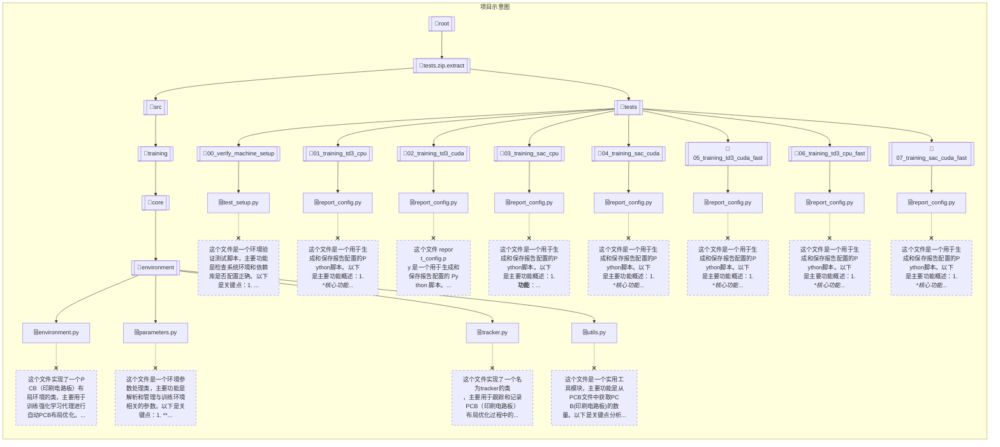

# GPT-Academic Report
## 接下来请你逐文件分析下面的工程[1/44] 请对下面的程序文件做一个概述: private_upload\default_user\2025-05-08-21-46-18\tests.zip.extract\experiments\00_parameter_exeperiments\report_config.py

这个文件是一个报告配置生成和管理的Python脚本，主要用于实验结果的图表和表格配置。以下是主要功能概述：

1. **配置保存与加载功能**：
   - `save_report_config()`：将报告配置保存为JSON文件
   - `load_report_config()`：从JSON文件加载报告配置

2. **图表配置**：
   - 定义了4个参数测试实验的图表配置（622/262/226/442）
   - 每个配置包含：
     - 实验名称和算法（TD3/SAC）
     - 图表显示选项（多代理、均值标准差、Y轴下限等）
     - 标题和轴标签
     - 系列标签

3. **表格配置**：
   - 当前为空字典（未配置表格）

4. **报告元数据**：
   - 包含作者信息和时间戳

5. **自动保存**：
   - 脚本执行时会自动将配置保存为"./report_config.json"

这个文件看起来是用于生成实验报告的可视化配置，特别是针对不同参数组合（622/262/226/442）的强化学习算法（TD3/SAC）性能比较。注释提到这些配置部分支持多代理场景。

## [2/44] 请对下面的程序文件做一个概述: private_upload\default_user\2025-05-08-21-46-18\tests.zip.extract\experiments\01_parameter_expert_experiments\report_config.py

这个文件 `report_config.py` 是一个用于生成和保存报告配置的Python脚本。以下是它的主要功能概述：

1. **功能**:
   - 定义了两个函数 `save_report_config` 和 `load_report_config`，用于将报告配置保存到JSON文件和从JSON文件加载报告配置。
   - 包含一个预定义的图表配置字典 `charts`，其中包含多个实验的图表设置（如参数测试、算法类型、多代理设置等）。
   - 包含一个空的 `tables` 字典，可能用于表格配置（当前未使用）。
   - 组合 `charts` 和 `tables` 到 `report_config` 字典，并添加作者和时间戳信息。
   - 最后调用 `save_report_config` 将配置保存到 `report_config.json` 文件。

2. **关键数据结构**:
   - `charts`: 包含多个实验的图表配置，每个实验指定了算法类型、图表标题、坐标轴标签等。
   - `report_config`: 最终的配置字典，包含图表、表格、作者和时间戳。

3. **用途**:
   - 该文件用于生成实验报告的配置，可能是某个参数实验项目的一部分。
   - 配置可以保存为JSON文件，便于后续加载和使用。

4. **注释掉的代码**:
   - 文件末尾有注释掉的代码，展示了如何加载和打印配置内容（可能是用于测试或调试）。

总结：这是一个简单的配置文件生成脚本，用于管理实验报告的图表和表格配置，支持JSON格式的保存和加载。

## [3/44] 请对下面的程序文件做一个概述: private_upload\default_user\2025-05-08-21-46-18\tests.zip.extract\experiments\02_ablation_experiments\report_config.py

这个文件是一个用于生成和保存实验报告配置的Python脚本。以下是主要功能概述：

1. **核心功能**：
   - 提供了`save_report_config()`和`load_report_config()`两个函数，用于将报告配置保存为JSON文件和从JSON文件加载配置
   - 定义了一个包含多个实验图表配置的`charts`字典
   - 创建了一个空的`tables`字典（预留表格配置）

2. **实验配置**：
   - 包含了6个不同的消融实验配置（ablation_test_xxx）
   - 每个实验配置了：
     - 使用的算法（TD3和SAC）
     - 是否是多智能体实验
     - 图表标题、坐标轴标签
     - 数据可视化参数（窗口大小、y轴限制等）

3. **元信息**：
   - 包含作者信息(Luke Vassallo)
   - 自动生成时间戳

4. **输出**：
   - 脚本运行时会将配置自动保存为`report_config.json`文件

5. **注释说明**：
   - 特别标注了多智能体支持状态
   - 包含了一些被注释掉的调试代码

这个文件主要用于管理实验报告的生成配置，特别是针对消融实验的可视化设置。配置以结构化的方式存储，便于后续的报告生成工具使用。

## [4/44] 请对下面的程序文件做一个概述: private_upload\default_user\2025-05-08-21-46-18\tests.zip.extract\experiments\03_ablation_expert_experiments\report_config.py

这个文件 `report_config.py` 是一个用于生成和保存实验报告配置的 Python 脚本。以下是其主要功能和结构概述：

### 核心功能
1. **配置管理**：
   - 提供了 `save_report_config()` 和 `load_report_config()` 函数，用于将报告配置保存为 JSON 文件或从 JSON 文件加载配置。

2. **实验图表配置**：
   - 定义了 `charts` 字典，包含多个消融实验（ablation tests）的图表配置，例如：
     - 实验名称（如 `ablation_test_055`）
     - 使用的算法（TD3 和 SAC）
     - 图表标题、坐标轴标签、显示范围等元数据
     - 多智能体（multi-agent）和均值-标准差绘图（mean-std-plot）的开关

3. **报告元数据**：
   - 包含作者信息（`author`）和时间戳（`timestamp`）。

### 文件操作
- 脚本最后调用 `save_report_config()`，将配置保存到 `./report_config.json` 文件。
- 注释掉的代码展示了如何加载和打印配置（`load_report_config()` 的示例用法）。

### 其他说明
- 文件属于 `03_ablation_expert_experiments` 实验的一部分，可能是用于生成消融测试的可视化报告。
- 配置中提到的实验名称（如 `ablation_expert_experiment_055`）暗示了实验参数（例如 `W=0, H=5, O=5`）。

### 典型用途
该文件可能被其他脚本或工具调用，以获取实验报告的图表和表格配置，用于自动化生成可视化结果。

## [5/44] 请对下面的程序文件做一个概述: private_upload\default_user\2025-05-08-21-46-18\tests.zip.extract\experiments\04_replay_buffer_sizing_experiments\report_config.py

这个文件是一个用于生成和保存实验报告配置的Python脚本。以下是主要功能概述：

1. **核心功能**：
   - 提供了`save_report_config()`和`load_report_config()`两个函数，用于将报告配置保存为JSON文件和从JSON文件加载配置
   - 定义了一个包含多个图表配置的字典`charts`，每个配置都包含实验参数、算法类型、图表标题和标签等信息
   - 创建了一个空的`tables`字典(预留空间)
   - 组合成完整的`report_config`字典，包含图表、表格、作者和时间戳信息

2. **图表配置特点**：
   - 主要测试不同大小的回放缓冲区策略(固定大小和可变大小)
   - 支持两种算法(TD3和SAC)的比较
   - 每个图表配置包含标题、坐标轴标签、窗口大小等绘图参数
   - 特别标注了多智能体环境下的部分支持情况

3. **自动执行**：
   - 脚本最后自动将配置保存为"./report_config.json"文件
   - 提供了注释掉的加载和打印配置的示例代码

4. **用途**：
   - 该文件似乎是用于自动化生成回放缓冲区大小调整实验的报告配置
   - 可能被其他脚本或工具用来生成标准化的实验报告图表

文件结构清晰，专注于实验结果的报告生成配置，不包含实际的实验逻辑或绘图代码。

## [6/44] 请对下面的程序文件做一个概述: private_upload\default_user\2025-05-08-21-46-18\tests.zip.extract\src\evaluation_scripts\eval_report_generator.py

这个文件是一个Python脚本，用于生成PCB组件布局评估报告的PDF文件。以下是主要功能概述：

1. **命令行参数处理**：
   - 使用`argparse`模块处理输入参数，包括实验目录、奖励参数、最大步数等。

2. **PDF报告生成**：
   - 使用`reportlab`库创建PDF文档，支持横向和纵向页面布局。
   - 自定义页码显示（Page X of Y）和日期。
   - 支持多种字体和样式。

3. **报告内容**：
   - 包含实验信息、机器信息、库信息等。
   - 从`results.txt`文件中读取PCB布局数据。
   - 生成表格展示原始试验数据或统计信息（均值±标准差）。

4. **数据处理**：
   - 计算不同重叠率（0%、10%、20%）下的线长指标。
   - 支持跳过模拟退火(SA)数据。

5. **输出选项**：
   - 可选择生成原始数据、均值数据或两者都包含的报告。

该脚本主要用于自动化生成PCB布局优化实验的评估报告，适合用于多代理系统或算法比较的场景。

## [7/44] 请对下面的程序文件做一个概述: private_upload\default_user\2025-05-08-21-46-18\tests.zip.extract\src\evaluation_scripts\eval_run_rl_policy.py

这个文件是一个用于评估多智能体PCB组件布局强化学习策略的Python脚本。以下是关键点概述：

1. **主要功能**：
   - 评估基于强化学习(TD3或SAC)的PCB组件布局策略
   - 支持多次运行评估并记录结果
   - 生成评估日志、PCB文件和可视化结果

2. **核心组件**：
   - `configure_seed()`: 配置随机种子
   - `cmdline_args()`: 处理命令行参数
   - `set_seed_everywhere()`: 设置全局随机种子
   - `evaluation_run()`: 执行评估的主要函数

3. **关键特性**：
   - 支持多种评估指标：HPWL(半周长线长)、重叠率等
   - 可记录不同重叠率(0%,10%,20%)下的最佳布局
   - 支持生成评估视频和日志文件
   - 提供详细的命令行参数配置

4. **输入/输出**：
   - 输入：训练好的RL模型、PCB文件、超参数文件
   - 输出：评估日志、最佳布局PCB文件、视频记录

5. **使用方式**：
   - 通过命令行参数配置评估参数
   - 支持单次或多次运行评估
   - 可控制输出详细程度和输出目录

该脚本主要用于验证强化学习模型在PCB布局问题上的性能，通过多种指标量化评估布局质量，并生成可视化的评估结果。

## [8/44] 请对下面的程序文件做一个概述: private_upload\default_user\2025-05-08-21-46-18\tests.zip.extract\src\evaluation_scripts\pcb2png.py

这个文件 `pcb2png.py` 是一个用于将 PCB (Printed Circuit Board) 文件转换为 PNG 图像的工具。以下是它的主要功能概述：

1. **命令行参数解析**:
   - 使用 `argparse` 模块解析命令行参数。
   - 必须提供输入 PCB 文件路径 (`-p/--pcb`) 和输出 PNG 文件路径 (`-o/--output`)。

2. **PCB 文件处理**:
   - 读取 PCB 文件并解析其内容。
   - 获取 PCB 的图形表示和电路板信息。

3. **图像生成**:
   - 使用 `pcbDraw` 模块中的函数绘制 PCB 的组件布局和鼠线网络 (ratsnest)。
   - 将组件布局和鼠线网络叠加生成最终的图像。

4. **输出**:
   - 使用 OpenCV (`cv2`) 将生成的图像保存为 PNG 文件。

**主要函数**:
- `command_line_args()`: 解析并返回命令行参数。
- `main()`: 主函数，处理 PCB 文件并生成 PNG 图像。

**依赖项**:
- `argparse`, `cv2`, `numpy` 等标准库。
- 项目内部的 `pcb` 和 `pcbDraw` 模块。

**用途**:
将 PCB 设计文件转换为可视化的 PNG 图像，便于查看或调试。

## [9/44] 请对下面的程序文件做一个概述: private_upload\default_user\2025-05-08-21-46-18\tests.zip.extract\src\evaluation_scripts\setup_info.py

这个文件 `setup_info.py` 是一个用于收集和显示机器及库信息的工具模块。以下是关键点概述：

1. **主要功能**：
   - `machine_info_in_paragraphs()`: 收集机器硬件信息（如CPU、内存、GPU等），并格式化为段落
   - `lib_info_in_paragraphs()`: 收集Python库版本信息，并格式化为段落

2. **技术特点**：
   - 使用多种系统信息库（`cpuinfo`, `psutil`, `pynvml`等）
   - 支持通过`reportlab.platypus.Paragraph`格式化输出
   - 包含自定义模块`pcb`和`graph`的构建信息

3. **输出格式**：
   - 所有信息都转换为HTML兼容格式（使用` `换行）
   - 接受样式参数来自定义文本显示

4. **依赖项**：
   - 需要多个第三方库（numpy, torch, optuna等）
   - 需要NVIDIA管理库（pynvml）来获取GPU信息

这个模块主要用于生成系统配置报告，适合在测试或文档中使用。

## [10/44] 请对下面的程序文件做一个概述: private_upload\default_user\2025-05-08-21-46-18\tests.zip.extract\src\report_generation\generate_experiment_report.py

这个文件是一个Python脚本，用于生成实验报告。以下是主要功能概述：

1. **主要功能**：
   - 从实验数据目录读取结果
   - 生成包含图表和表格的PDF格式实验报告
   - 支持多种实验配置和算法比较

2. **关键特性**：
   - 使用ReportLab库生成PDF文档
   - 支持Matplotlib图表生成
   - 包含实验元数据（机器信息、库信息等）
   - 支持横向和纵向页面布局
   - 自动添加页码和时间戳

3. **输入输出**：
   - 输入：实验数据目录、报告配置文件
   - 输出：PDF格式的实验报告

4. **主要组件**：
   - 参数解析器（argparse）
   - 报告配置加载器（JSON格式）
   - 图表生成器（使用Matplotlib）
   - 表格生成器
   - PDF构建器（使用ReportLab）

5. **特殊功能**：
   - 支持多代理实验数据
   - 可配置的图表参数（标题、标签、限制等）
   - 自动清理临时目录
   - 交互式提示（可跳过）

这个脚本适合用于自动化实验结果的汇总和报告生成，特别适合需要定期生成标准化实验报告的研究项目。

## [11/44] 请对下面的程序文件做一个概述: private_upload\default_user\2025-05-08-21-46-18\tests.zip.extract\src\report_generation\gen_utils.py

这个文件 `gen_utils.py` 是一个用于生成报告和可视化数据的实用工具模块。以下是它的主要功能概述：

### 主要功能
1. **数据处理与统计**:
   - `generate_table()`: 计算并返回数据的均值、标准差和组合统计结果。
   - `generate_dataset()`: 从日志文件中读取数据，处理并返回一个包含所有数据帧的字典。

2. **数据可视化**:
   - `generate_plot()`: 使用 Seaborn 生成单条线图，展示奖励或回合长度随时间的变化。
   - `generate_multi_agent_plot()`: 为多个代理生成单独的线图。
   - `generate_multi_agent_plot_w_mean_std()`: 为多个代理生成带有均值和标准差的线图。

3. **辅助功能**:
   - `sort_key()`: 用于按运行编号对批次数据进行排序的辅助函数。

### 关键特点
- 支持从日志文件（`training.log`）中读取数据。
- 提供数据平滑处理（滚动平均）。
- 支持多种可视化选项（奖励、回合长度等）。
- 自动处理时间步长和标签格式（如 "M" 表示百万，"k" 表示千）。

### 依赖库
- `pandas`: 用于数据处理。
- `numpy`: 用于数值计算。
- `seaborn`: 用于数据可视化。
- `os`: 用于文件路径操作。

### 适用场景
该模块适用于强化学习实验的结果分析和可视化，特别适合处理多代理、多运行批次的数据，并生成统计摘要和图表。

## [12/44] 请对下面的程序文件做一个概述: private_upload\default_user\2025-05-08-21-46-18\tests.zip.extract\src\report_generation\setup_info.py

# 文件概述

**文件名**: tests.zip.extract\src\report_generation\setup_info.py

**功能**: 该文件属于报告生成模块的一部分，主要处理与报告生成相关的设置信息。从文件名可以推断它可能包含以下内容：

1. 报告生成所需的配置参数
2. 初始化设置相关的函数或类
3. 报告生成环境的准备逻辑

**典型用途**:
- 定义报告模板、格式等基础设置
- 提供报告生成所需的路径、参数等配置信息
- 可能包含报告生成前的初始化逻辑

由于没有提供具体代码内容，以上是基于文件名和路径的合理推测。如需更准确的分析，请提供文件的具体代码内容。

## [13/44] 请对下面的程序文件做一个概述: private_upload\default_user\2025-05-08-21-46-18\tests.zip.extract\src\training\callbacks.py

这个文件是一个Python模块，实现了一个训练回调类`log_and_eval_callback`，主要用于在强化学习训练过程中进行日志记录和模型评估。以下是关键点概述：

1. **主要功能**：
   - 记录训练指标（奖励、损失等）到TensorBoard
   - 定期评估模型性能
   - 保存最佳模型
   - 记录训练设置和超参数
   - 生成评估视频和布局文件

2. **核心方法**：
   - `on_step()`: 在每个训练步骤后调用，记录指标并检查是否进行评估
   - `on_training_start()`: 训练开始时初始化日志和记录初始状态
   - `on_training_end()`: 训练结束时进行最终评估和清理
   - `evaluate()`: 执行模型评估，支持训练集和测试集评估
   - `log_video()`: 将评估视频记录到TensorBoard
   - `log_settings()`: 记录实验配置信息

3. **关键特性**：
   - 支持两种最佳模型保存："best"（单次最高奖励）和"best_mean"（平均最高奖励）
   - 提供详细的PCB布局评估功能，记录不同重叠条件下的最佳布局
   - 支持SAC和TD3两种强化学习算法
   - 包含早期停止机制

4. **文件操作**：
   - 创建和管理多个日志和输出目录
   - 保存模型检查点
   - 记录训练过程到日志文件
   - 生成评估视频和截图

这个回调类为PCB布局优化任务的强化学习训练提供了全面的监控和评估功能。

## [14/44] 请对下面的程序文件做一个概述: private_upload\default_user\2025-05-08-21-46-18\tests.zip.extract\src\training\data_augmenter.py

这个文件实现了一个用于图形数据增强的类 `dataAugmenter`。以下是关键点概述：

1. **主要功能**：
   - 对图形数据应用平移和旋转变换进行增强
   - 支持对组件位置和方向的单独控制

2. **核心类**：
   - `dataAugmenter` 类：
     - 初始化参数包括板尺寸、最大平移量、目标位置等
     - 主要方法 `augment_graph()` 执行实际的图形增强
     - 可设置平移限制 `set_translation_limits()`

3. **关键特性**：
   - 支持随机平移（x/y轴）和旋转（90°倍数）
   - 可配置是否增强位置或方向
   - 支持自定义随机数生成器
   - 包含重置图形和设置组件原点的功能

4. **依赖项**：
   - numpy
   - logging
   - 多个内部图形模块(graph, board, node, edge)
   - 图形工具函数(kicad_rotate_around_point)

5. **典型用途**：
   - 在PCB布局等场景中增强图形数据
   - 生成训练数据的变体以提高模型鲁棒性

文件结构清晰，注释完整，提供了灵活的图形数据增强功能。

## [15/44] 请对下面的程序文件做一个概述: private_upload\default_user\2025-05-08-21-46-18\tests.zip.extract\src\training\graph_utils.py

这个文件 `graph_utils.py` 是一个提供图形旋转操作的工具模块，主要用于实现 KiCad 软件的旋转公式。以下是关键点概述：

1. **功能**:
   - 提供两个核心函数：`kicad_rotate` 和 `kicad_rotate_around_point`，用于执行 2D 点的旋转操作。
   - 支持绕原点或任意中心点的旋转。

2. **实现细节**:
   - 使用 `numpy` 进行三角函数计算。
   - 角度输入为度(°)，内部转换为弧度(rad)。
   - 旋转矩阵采用标准 2D 旋转公式。

3. **输入输出**:
   - 输入：坐标(x,y)和旋转角度(a)
   - 输出：旋转后的坐标列表 [rx, ry]

4. **典型应用场景**:
   - 电路板设计中的元件旋转
   - 图形处理中的坐标变换

5. **代码特点**:
   - 简洁直接的数学实现
   - 良好的文档字符串说明
   - 无外部依赖(仅需 numpy)

这个模块适合需要精确 2D 旋转操作的场景，特别是需要与 KiCad 软件兼容的应用。

## [16/44] 请对下面的程序文件做一个概述: private_upload\default_user\2025-05-08-21-46-18\tests.zip.extract\src\training\hyperparameters.py

这个文件`hyperparameters.py`是一个用于管理和优化强化学习模型超参数的Python模块。以下是其主要功能的概述：

1. **全局变量**：定义了一系列神经网络架构的最小和最大层数、神经元数量等超参数范围。

2. **核心功能**：
   - `gen_default_hyperparameters()`: 生成默认的超参数配置，支持on-policy和off-policy算法。
   - `gen_default_sb3_hyperparameters()`: 为特定算法(TRPO, PPO, TD3, SAC)生成默认配置。
   - `sample_hyperparameters()`: 使用Optuna框架采样超参数，支持网络架构搜索。
   - `sample_hyperparameters_nas()`: 针对特定算法进行网络架构搜索。
   - `sample_hyperparameters_hp()`: 优化超参数而非网络架构。

3. **辅助功能**：
   - 加载/保存超参数到JSON文件
   - 保存最佳超参数配置
   - 判断超参数配置属于on-policy还是off-policy算法

4. **Optuna集成**：
   - 提供了与Optuna框架集成的功能，用于超参数优化
   - 可以设置用户属性以方便报告生成

该模块主要用于强化学习训练过程中的超参数管理和优化，特别是与Stable Baselines3框架配合使用。它支持多种强化学习算法，并提供了灵活的配置选项。

## [17/44] 请对下面的程序文件做一个概述: private_upload\default_user\2025-05-08-21-46-18\tests.zip.extract\src\training\model_setup.py

这个文件 `model_setup.py` 是一个用于设置和初始化强化学习模型的模块。以下是它的主要功能概述：

1. **功能**:
   - 提供函数来初始化和配置两种强化学习模型：TD3 (Twin Delayed DDPG) 和 SAC (Soft Actor-Critic)。
   - 通过统一的接口 `setup_model` 来创建指定类型的模型。

2. **主要函数**:
   - `td3_model_setup()`: 初始化并返回一个 TD3 模型实例。
   - `sac_model_setup()`: 初始化并返回一个 SAC 模型实例。
   - `setup_model()`: 根据输入的模型类型调用对应的初始化函数。

3. **参数**:
   - 所有函数都接受训练环境 (`train_env`)、超参数 (`hyperparameters`)、设备 (`device`)、提前停止步数 (`early_stopping`) 和日志级别 (`verbose`) 等参数。
   - 默认设备是 CPU (`"cpu"`)，默认提前停止步数是 100,000。

4. **依赖**:
   - 导入了 `TD3` 和 `SAC` 模块来实际创建模型实例。

5. **错误处理**:
   - 如果传入不支持的模型类型，`setup_model` 会打印错误信息并列出支持的模型类型。

这个模块的主要目的是提供一个统一的接口来简化强化学习模型的初始化过程。

## [18/44] 请对下面的程序文件做一个概述: private_upload\default_user\2025-05-08-21-46-18\tests.zip.extract\src\training\pcbDraw.py

这个文件 `pcbDraw.py` 是一个用于绘制PCB(印刷电路板)布局的Python模块。以下是对该文件的简要分析：

### 主要功能
1. 提供多种绘图函数来可视化PCB布局和组件
2. 支持单组件和多组件(多代理)的绘制模式
3. 可以绘制PCB板边界、已放置组件、未放置组件、鼠线(ratsnest)等
4. 支持添加调试信息和组件名称标签
5. 提供视线(LOS)和重叠检测功能

### 关键特点
- 使用OpenCV(cv2)进行图像处理和绘制
- 使用numpy数组存储和处理图像数据
- 支持分辨率设置(全局变量r)
- 提供padding(填充)选项
- 支持多种输出格式(灰度图像)

### 主要函数
1. `draw_board_from_board_and_graph` - 基本PCB绘制函数
2. `draw_board_from_board_and_graph_with_debug` - 带调试信息的绘制
3. `draw_board_from_board_and_graph_multi_agent` - 多组件绘制
4. `draw_ratsnest` - 绘制鼠线(组件间的连接线)
5. `draw_los` - 绘制视线区域
6. `get_los_and_ol_multi_agent` - 获取视线和重叠信息

### 依赖项
- numpy
- OpenCV(cv2)
- 自定义graph模块(graph, board, node, edge等类)
- graph_utils模块

### 使用场景
这个模块似乎是为PCB布局优化或自动化布局工具设计的，可能用于:
- 可视化PCB布局
- 调试布局算法
- 训练机器学习模型(如多代理系统)
- 分析组件放置和连接

文件结构清晰，函数命名规范，提供了多种绘图选项和配置参数，适合集成到更大的PCB设计工具链中。

## [19/44] 请对下面的程序文件做一个概述: private_upload\default_user\2025-05-08-21-46-18\tests.zip.extract\src\training\pcb_vector_utils.py

这个文件 `pcb_vector_utils.py` 是一个处理 PCB（印刷电路板）相关向量计算的工具模块。以下是其主要功能概述：

### 核心功能
1. **坐标转换**：
   - `polar_to_rectangular` 和 `rectangular_to_polar` 实现极坐标和直角坐标的相互转换。
   - `calculate_resultant_vector` 计算二维向量的欧几里得距离和角度。

2. **PCB 组件向量计算**：
   - `compute_pad_referenced_distance_vectors_v2` 计算 PCB 组件焊盘之间的连接向量，并汇总为合向量。
   - `sort_resultant_vectors` 对合向量进行排序。

3. **距离计算**：
   - `compute_sum_of_euclidean_distances` 和 `compute_sum_of_euclidean_distances_between_pads` 计算组件或焊盘之间的欧几里得距离总和。
   - `distance_between_two_points` 计算两点之间的直线距离。

4. **视线（LOS）相关功能**：
   - `get_los_feature_vector` 计算组件到障碍物的视线距离特征向量。
   - `shortest_distance_to_object_within_segment` 计算视线段内到最近物体的距离。

5. **角度处理**：
   - `wrap_angle` 将角度限制在 -π 到 π 之间。
   - `deg2rad` 和 `rad2deg` 实现角度和弧度的相互转换。

### 辅助功能
- `distance_from_rectangle_center_to_edge` 计算从矩形中心到边缘的距离。
- `cosine_distance_for_two_terminal_component` 计算两个终端组件向量的余弦距离。

### 依赖项
- 主要使用 `numpy` 进行数学计算。
- 从 `graph_utils` 导入 `kicad_rotate` 进行旋转操作。
- 从 `pcbDraw` 导入绘图相关功能。

### 应用场景
该模块主要用于 PCB 设计自动化，特别是在组件布局优化、距离测量和视线分析等方面。

## [20/44] 请对下面的程序文件做一个概述: private_upload\default_user\2025-05-08-21-46-18\tests.zip.extract\src\training\run_config.py

这个文件`run_config.py`是一个Python脚本，主要用于配置和管理PCB组件训练的运行时参数。以下是它的主要功能概述：

1. **命令行参数解析**：
   - 使用`argparse`模块定义和解析大量训练相关的参数，包括策略类型(TD3/SAC)、随机种子、训练步数、模型保存/加载路径、设备选择(cuda/cpu)等。

2. **配置管理**：
   - `cmdline_args()`函数处理所有命令行参数，并将它们组织到一个`settings`字典中返回
   - 包含向后兼容性处理(如`rl_model_type`和`max_steps`别名)

3. **随机种子配置**：
   - `configure_seed()`函数根据参数自动生成或使用指定的随机种子
   - 支持自动种子生成(基于当前时间)和手动指定种子

4. **日志记录**：
   - `write_desc_log()`函数将配置信息、超参数和模型架构写入日志文件
   - 包含详细的格式化和分类信息输出

5. **依赖管理**：
   - 脚本会记录PCB和graph模块的构建信息

该脚本主要作为训练流程的配置入口，为强化学习训练提供灵活的参数控制和日志记录功能。它被设计为与PCB组件训练系统配合使用，支持多种训练场景和配置选项。

## [21/44] 请对下面的程序文件做一个概述: private_upload\default_user\2025-05-08-21-46-18\tests.zip.extract\src\training\SAC.py

这个文件实现了一个Soft Actor-Critic (SAC)强化学习算法。以下是主要组成部分的概述：

1. **核心组件**：
   - `QNetwork`：双Q网络结构，用于评估状态-动作对的价值
   - `GaussianPolicy`：高斯策略网络，用于生成动作和评估策略
   - `SAC`：主类，整合了所有SAC算法组件

2. **关键功能**：
   - 实现了SAC的核心训练逻辑，包括：
     - 策略评估（critic更新）
     - 策略改进（actor更新）
     - 自动熵调节
   - 支持经验回放（ReplayMemory）
   - 提供模型保存/加载功能

3. **技术特点**：
   - 使用PyTorch实现
   - 支持GPU加速
   - 包含目标网络和软更新机制
   - 实现了早期停止和增量经验回放等实用功能

4. **训练相关**：
   - 提供了完整的训练循环（`learn`方法）
   - 包含探索策略（`explore_for_expert_targets`）
   - 支持回调函数

这个实现是一个完整的SAC算法实现，适用于连续动作空间的强化学习任务，可以与OpenAI Gym风格的环境配合使用。

## [22/44] 请对下面的程序文件做一个概述: private_upload\default_user\2025-05-08-21-46-18\tests.zip.extract\src\training\TD3.py

这个文件实现了Twin Delayed Deep Deterministic Policy Gradient (TD3)算法，这是一种深度强化学习算法。以下是主要组成部分的概述：

1. **Actor类**：
   - 策略网络，输出连续动作
   - 使用多层感知器(MLP)结构
   - 支持ReLU和Tanh激活函数
   - 包含选择动作的方法

2. **Critic类**：
   - 双Q值网络，评估状态-动作对的价值
   - 同样使用MLP结构
   - 包含两个独立的Q网络(Q1和Q2)

3. **TD3主类**：
   - 实现了完整的TD3算法
   - 包含训练循环(learn方法)
   - 支持经验回放缓冲区
   - 实现了目标网络更新(tau参数)
   - 包含策略延迟更新(policy_freq参数)
   - 支持模型保存/加载
   - 包含探索机制

4. **关键特性**：
   - 支持GPU/CPU训练
   - 可配置的网络架构
   - 包含早期停止机制
   - 支持增量式经验回放缓冲区扩展
   - 集成了训练监控(tracker)

5. **辅助功能**：
   - 与环境交互的接口
   - 训练回调机制
   - 性能指标跟踪

这个实现遵循了TD3论文的核心思想，包括双Q学习、目标策略平滑和延迟策略更新等技术，适用于连续动作空间的强化学习任务。

## [23/44] 请对下面的程序文件做一个概述: private_upload\default_user\2025-05-08-21-46-18\tests.zip.extract\src\training\test_pcb_vector_utils.py

这是一个简单的单元测试文件，用于测试 `pcb_vector_utils` 模块中的 `calculate_resultant_vector` 函数。

关键点：
1. 文件路径：`tests.zip.extract\src\training\test_pcb_vector_utils.py`
2. 测试内容：验证当输入两个0.0值时，函数是否能正确处理并返回(0.0, 0.0)而不是NaN
3. 测试方法：使用assert语句验证返回的欧几里得距离和角度值
4. 测试场景：专门针对边界条件（两个输入都为0.0）进行测试

这个测试文件非常简洁，只包含一个测试函数，用于检查向量计算函数在极端情况下的行为。

## [24/44] 请对下面的程序文件做一个概述: private_upload\default_user\2025-05-08-21-46-18\tests.zip.extract\src\training\tracker.py

这个 `tracker.py` 文件实现了一个用于跟踪强化学习训练指标的类 `tracker`。以下是它的核心功能概述：

1. **主要用途**：
   - 跟踪和记录强化学习训练过程中的关键指标
   - 支持两种强化学习策略类型：TD3 和 SAC

2. **核心功能**：
   - 初始化时设置滑动窗口大小 (`avg_size`) 和策略类型 (`rl_policy_type`)
   - 使用 `deque` 数据结构维护多个指标的滑动窗口
   - 提供添加新数据 (`append` 方法)
   - 提供获取指标平均值 (`get_mean` 方法)
   - 提供获取最近一次记录 (`get_most_recent` 方法)

3. **跟踪的指标**：
   - 基本指标：actor损失、critic损失、回合奖励、回合长度、FPS
   - SAC特有指标：critic_1损失、critic_2损失、熵损失、熵值

4. **代码特点**：
   - 使用 `numpy` 计算平均值
   - 对空队列有保护处理
   - 通过条件判断处理不同策略类型的特有指标

这个类适合在强化学习训练循环中被调用，用于收集和汇总训练过程中的性能指标。

## [25/44] 请对下面的程序文件做一个概述: private_upload\default_user\2025-05-08-21-46-18\tests.zip.extract\src\training\train.py

这个文件 `train.py` 是一个用于训练 PCB 布线环境中的智能体的主脚本。以下是其核心结构和功能概述：

### 主要功能
1. **训练设置**：
   - 设置随机种子（`setup_seed`）确保实验可复现
   - 处理设备选择（CPU/GPU）
   - 配置日志记录（TensorBoard）

2. **训练流程**：
   - 加载超参数和环境配置
   - 创建 PCB 布线环境（`environment`）
   - 设置模型（`setup_model`）
   - 执行训练循环（`model.learn`）
   - 评估和记录性能指标

3. **辅助功能**：
   - 命令行参数解析（`cmdline_args`）
   - 标准输出/错误重定向
   - 多轮训练运行和结果统计

### 关键组件
- **环境**：`core.environment.environment`
- **参数**：`core.environment.parameters`
- **模型**：通过 `model_setup.setup_model` 初始化
- **回调**：`log_and_eval_callback` 处理日志和评估

### 执行方式
直接运行脚本会执行 `main()` 函数，启动训练流程。

### 特点
- 支持多轮训练运行并计算平均性能
- 可配置超参数和环境参数
- 包含详细的日志记录功能
- 支持随机种子设置以确保可复现性

这个脚本是 PCB 布线强化学习训练流程的核心控制器，协调环境、模型和训练过程的交互。

## [26/44] 请对下面的程序文件做一个概述: private_upload\default_user\2025-05-08-21-46-18\tests.zip.extract\src\training\utils.py

这个文件`utils.py`是一个用于强化学习的工具模块，主要包含以下功能：

1. **模型参数更新工具**：
   - `soft_update()`：执行软更新（参数渐进式更新）
   - `hard_update()`：执行硬更新（直接复制参数）

2. **经验回放缓冲区**：
   - 定义了一个`Transition`命名元组，用于存储状态转移信息
   - 实现了`ReplayMemory`类，提供经验回放功能，包括：
     - 添加/获取经验数据
     - 从缓冲区随机采样
     - 合并其他缓冲区的数据
     - 重置缓冲区等操作

3. **主要特点**：
   - 支持PyTorch张量操作
   - 可指定存储设备（CPU/GPU）
   - 实现了多种采样策略（包括从最新数据中采样）
   - 提供了缓冲区容量管理和数据整理功能

这个模块是强化学习训练过程中常用的工具集，特别是与深度Q学习(DQN)等算法配合使用。

## [27/44] 请对下面的程序文件做一个概述: private_upload\default_user\2025-05-08-21-46-18\tests.zip.extract\src\training\core\video_utils.py

这个文件 `video_utils.py` 是一个视频处理工具模块，主要用于创建和操作视频帧。以下是其主要功能的概述：

### 主要功能
1. **视频创建与处理**:
   - `create_video()`: 从组件网格和鼠线数据创建视频，支持添加调试信息和指标数据
   - `video_frames()`: 生成视频帧缓冲区，包含初始ID帧和组件帧
   - `write_frame_buffer()`: 将帧缓冲区写入视频文件

2. **图像处理**:
   - `create_image()`: 从最后一帧组件网格创建静态图像
   - `get_video_tensor()`: 将视频帧转换为PyTorch张量格式

### 关键特点
- 使用OpenCV (cv2)进行视频/图像处理
- 支持添加文本覆盖(帧号、组件ID、指标等)
- 可处理灰度图像(单通道)
- 支持调试模式(`draw_debug`参数)
- 自动生成时间戳文件名

### 输入/输出
- 主要输入: 组件网格(`all_comp_grids`)、鼠线数据(`ratsnest`)
- 输出: MP4视频文件、图像文件或PyTorch张量

### 依赖项
- OpenCV (`cv2`)
- NumPy
- PyTorch (仅`get_video_tensor`函数需要)

这个模块似乎是为某种电子设计自动化(EDA)或电路板布局可视化工具设计的，因为代码中提到了"ratsnest"(鼠线，PCB布线术语)和组件指标。

## [28/44] 请对下面的程序文件做一个概述: private_upload\default_user\2025-05-08-21-46-18\tests.zip.extract\src\training\core\agent\agent.py

这是一个基于OpenAI Gym框架实现的强化学习环境类，用于PCB(印刷电路板)布局优化任务。以下是对该文件的简要分析：

1. **类结构**：
   - 继承自`gym.Env`，实现了标准的强化学习环境接口
   - 主要方法包括`reset()`、`step()`和`get_reward()`

2. **核心功能**：
   - 定义了观察空间(observation space)和动作空间(action space)
   - 通过`step()`方法执行动作并返回新的状态、奖励等信息
   - 使用欧几里得距离和HPWL(半周长线长)作为优化目标
   - 支持TD3和SAC两种强化学习算法

3. **关键特性**：
   - 包含重叠检测和边界检查
   - 实现了自定义的奖励函数
   - 支持随机初始化和确定性动作选择
   - 提供日志记录功能

4. **依赖关系**：
   - 使用了NumPy进行数值计算
   - 依赖多个自定义模块如`pcb_vector_utils`、`pcbDraw`等

这个类主要用于训练智能体优化PCB板上元件的位置和方向，以减少布线长度和重叠。

## [29/44] 请对下面的程序文件做一个概述: private_upload\default_user\2025-05-08-21-46-18\tests.zip.extract\src\training\core\agent\observation.py

这个文件`observation.py`是一个用于处理PCB（印刷电路板）布局中智能体观察数据的模块。主要功能包括：

1. **核心功能**：
   - 计算视线(LOS)和重叠(OL)信息
   - 获取智能体观察数据
   - 计算距离向量和角度

2. **主要函数**：
   - `line_of_sight_and_overlap_v0()`: 计算8个方向的视线和重叠网格数据
   - `get_agent_observation()`: 获取智能体的完整观察数据，包括：
     * 视线和重叠信息
     * 主导向量(dom)
     * 欧几里得距离和角度(euc_dist)
     * 位置和方向信息

3. **依赖模块**：
   - `pcbDraw`: 用于绘制PCB相关图形
   - `pcb_vector_utils`: 提供向量计算工具

4. **输出格式**：
   - 返回一个包含多种观察指标的字典，用于PCB布局的智能体决策

该模块主要用于PCB布局优化中的多智能体系统，提供环境感知数据。

## [30/44] 请对下面的程序文件做一个概述: private_upload\default_user\2025-05-08-21-46-18\tests.zip.extract\src\training\core\agent\parameters.py

这个文件实现了一个`parameters`类，用于管理和存储与PCB(印刷电路板)环境相关的参数。以下是关键点：

1. **主要功能**：
   - 从输入的`pcb_params`字典中提取并存储PCB环境参数
   - 提供参数转字符串的功能

2. **核心参数**：
   - PCB板信息(board, graph, width/height)
   - 节点和邻居信息(node, neighbors)
   - 优化参数(opt_euclidean_distance, opt_hpwl)
   - 训练参数(step_size, max_steps, expl_noise)
   - 网络参数(nets, net, ignore_power)

3. **方法**：
   - `__init__`: 初始化并验证参数
   - `to_string`: 将参数格式化为可读字符串(排除复杂对象)
   - 空方法：`write_to_file`和`write_to_tensoboard`(占位)

4. **特点**：
   - 参数验证：要求必须提供PCB参数
   - 敏感参数过滤：toString时跳过复杂对象
   - 硬编码参数：如padding=4

这个类主要用于集中管理PCB环境配置，便于在强化学习训练中使用。

## [31/44] 请对下面的程序文件做一个概述: private_upload\default_user\2025-05-08-21-46-18\tests.zip.extract\src\training\core\agent\pcb_vector_utils.py

这个文件 `pcb_vector_utils.py` 是一个用于处理 PCB（印刷电路板）相关向量计算的工具模块。以下是其主要功能的概述：

### 主要功能
1. **坐标转换**：
   - `polar_to_rectangular` 和 `rectangular_to_polar` 用于极坐标和直角坐标之间的转换。

2. **距离向量计算**：
   - `compute_pad_referenced_distance_vectors_v2` 计算 PCB 元件焊盘之间的连接向量，并生成合成向量和方向向量。
   - `compute_vector_to_group_midpoint` 计算当前元件到一组元件中心点的向量。

3. **距离计算**：
   - `compute_sum_of_euclidean_distances` 和 `compute_sum_of_euclidean_distances_between_pads` 计算元件之间的欧几里得距离总和。
   - `distance_between_two_points` 计算两点之间的直线距离。

4. **视线（LOS）特征提取**：
   - `get_los_feature_vector` 使用视线方法检测元件周围的障碍物，并生成特征向量。

5. **角度处理**：
   - `wrap_angle` 和 `cosine_distance_for_two_terminal_component` 处理角度相关的计算和转换。

### 辅助功能
- `deg2rad` 和 `rad2deg` 用于角度和弧度之间的转换。
- `distance_from_rectangle_center_to_edge` 计算从矩形中心到边缘的距离。

### 依赖项
- 使用了 `numpy` 进行数学运算。
- 依赖 `graph_utils` 和 `pcbDraw` 模块中的功能。

### 用途
该模块主要用于 PCB 设计自动化中的元件布局优化，通过计算元件之间的向量和距离来辅助布局决策。

## [32/44] 请对下面的程序文件做一个概述: private_upload\default_user\2025-05-08-21-46-18\tests.zip.extract\src\training\core\agent\tracker.py

这个文件实现了一个跟踪器(tracker)类，主要用于记录和处理组件网格(comp_grids)和鼠巢(ratsnest)数据，并生成视频输出。以下是关键点：

1. **核心功能**：
   - 使用双端队列(deque)存储历史数据（`all_comp_grids`和`ratsnest`）
   - 提供添加观测数据的方法（`add_observation`和`add_ratsnest`）
   - 支持视频生成（`create_video`）和帧缓冲处理（`update_frame_buffer`）

2. **主要属性**：
   - `maxlen`：限制存储的历史数据量（默认1024）
   - `all_comp_grids`：存储组件网格历史
   - `ratsnest`：存储鼠巢历史
   - `frame_buffer`：用于视频帧的numpy数组

3. **工具方法**：
   - `reset()`：清空存储的数据
   - `write_frame_buffer()`：写入帧缓冲数据并重置

4. **依赖关系**：
   - 使用`video_utils`模块处理视频相关功能
   - 使用numpy进行数组操作

这个类似乎是为某种训练或模拟环境设计的跟踪记录工具，特别关注组件网格和鼠巢数据的可视化输出。

## [33/44] 请对下面的程序文件做一个概述: private_upload\default_user\2025-05-08-21-46-18\tests.zip.extract\src\training\core\environment\environment.py

这个文件实现了一个PCB（印刷电路板）布局环境的类，主要用于训练强化学习代理进行自动PCB布局优化。以下是对该文件的关键分析：

1. **主要功能**：
   - 管理PCB布局环境的状态和交互
   - 处理PCB文件读取和初始化
   - 为强化学习代理提供环境接口（reset/step等）
   - 支持数据增强和可视化调试

2. **核心类**：
   - `environment`类：主环境类，包含PCB布局的所有状态和操作

3. **关键方法**：
   - `__init__`: 初始化环境，读取PCB文件
   - `reset`: 重置环境状态
   - `step`: 执行一个环境步骤
   - `initialize_environment_state_from_pcb`: 从PCB文件初始化环境状态
   - 各种辅助方法用于获取信息、保存PCB文件等

4. **依赖关系**：
   - 与`pcb`、`graph`、`agent`等模块紧密交互
   - 使用`dataAugmenter`进行数据增强
   - 使用`tracker`记录训练过程

5. **特点**：
   - 支持多代理强化学习
   - 包含调试和可视化功能
   - 处理PCB布局的物理约束和优化目标

这个文件是PCB自动布局系统的核心环境实现，为强化学习算法提供了必要的交互接口和环境状态管理。

## [34/44] 请对下面的程序文件做一个概述: private_upload\default_user\2025-05-08-21-46-18\tests.zip.extract\src\training\core\environment\parameters.py

这个文件是一个环境参数处理类，主要功能是解析和管理与训练环境相关的参数。以下是关键点：

1. **核心功能**：
   - 从输入的参数字典中提取并存储环境配置参数
   - 提供参数输出功能（字符串和文本格式）

2. **主要参数**：
   - PCB相关参数（训练/评估PCB、PCB文件）
   - 数据增强配置
   - 智能体动作参数
   - 奖励权重参数（n/m/p）
   - 调试和日志相关参数

3. **主要方法**：
   - `__init__`: 参数初始化
   - `to_string()`: 返回HTML格式的参数摘要
   - `to_text_string()`: 返回纯文本格式的参数列表

4. **注意事项**：
   - 需要传入完整的参数字典，否则会报错
   - 包含TODO标记，提示需要添加错误检查
   - 有未实现的文件写入方法（write_to_file/write_to_tensoboard）

这个类主要用于集中管理训练环境的各种配置参数，便于统一访问和调试输出。

## [35/44] 请对下面的程序文件做一个概述: private_upload\default_user\2025-05-08-21-46-18\tests.zip.extract\src\training\core\environment\tracker.py

这个文件实现了一个名为`tracker`的类，主要用于跟踪和记录PCB（印刷电路板）布局优化过程中的各种指标和数据。以下是主要功能概述：

1. **数据跟踪**：
   - 使用`deque`结构存储组件网格(`all_comp_grids`)、鼠线(`ratsnest`)、奖励(`rewards`)和指标(`metrics`)
   - 支持添加和获取这些数据

2. **可视化功能**：
   - `create_video()`：生成优化过程的视频
   - `create_plot()`：创建包含多种指标(W, raw_W, HPWL等)的6个子图的图表
   - `capture_snapshot()`：捕获当前状态的图像

3. **数据记录**：
   - `log_run_to_file()`：将跟踪数据写入文件，包括时间戳、组件信息和各步骤的指标

4. **辅助功能**：
   - `reset()`：清除所有跟踪数据
   - `video_tensor()`：获取视频张量表示

这个类似乎是一个PCB布局优化系统的监控组件，用于记录优化过程、生成可视化结果和分析性能指标。它依赖于`video_utils`模块来处理视频和图像生成。

## [36/44] 请对下面的程序文件做一个概述: private_upload\default_user\2025-05-08-21-46-18\tests.zip.extract\src\training\core\environment\utils.py

这个文件是一个实用工具模块，主要功能是从PCB文件中获取PCB(印刷电路板)的数量。以下是关键点分析：

1. **主要功能**：
   - 提供`get_pcb_num()`函数，用于读取PCB文件并返回其中包含的PCB数量

2. **代码结构**：
   - 从`pcb`模块导入`pcb`
   - 包含一个工具函数`get_pcb_num()`

3. **函数逻辑**：
   - 函数接收PCB文件路径作为输入
   - 使用`pcb.vptr_pcbs()`创建PCB容器
   - 通过`pcb.read_pcb_file()`读取文件内容到容器
   - 返回容器长度作为PCB数量

4. **依赖关系**：
   - 依赖于外部的`pcb`模块及其功能

5. **典型用途**：
   - 在需要统计PCB文件中电路板数量的场景中使用

该模块设计简单直接，专注于单一功能，符合工具函数的典型特征。

## [37/44] 请对下面的程序文件做一个概述: private_upload\default_user\2025-05-08-21-46-18\tests.zip.extract\tests\00_verify_machine_setup\test_setup.py

这个文件是一个环境验证测试脚本，主要功能是检查系统环境和依赖库是否配置正确。以下是关键点：

1. **系统信息检查**：
   - 打印操作系统信息（uname）
   - 获取并显示CPU信息（架构、核心数、频率等）
   - 显示系统内存大小

2. **软件依赖检查**：
   - 验证Python版本
   - 检查关键库版本（PyTorch、Optuna、NumPy等）
   - 检测CUDA可用性和GPU信息（如果有）

3. **二进制工具测试**：
   - 测试3个PCB工具（kicadParser、sa、pcb_router）是否可用

4. **其他功能**：
   - 打印程序启动时间
   - 调用graph和pcb模块的build_info()

这是一个典型的开发环境验证脚本，用于确保所有必要的硬件/软件组件都已正确安装，通常会在项目初始化或CI/CD流程中运行。

## [38/44] 请对下面的程序文件做一个概述: private_upload\default_user\2025-05-08-21-46-18\tests.zip.extract\tests\01_training_td3_cpu\report_config.py

这个文件是一个用于生成和保存报告配置的Python脚本。以下是主要功能概述：

1. **核心功能**：
   - 提供了`save_report_config()`和`load_report_config()`两个函数，用于将报告配置保存到JSON文件和从JSON文件加载配置
   - 定义了一个报告配置字典`report_config`，包含图表配置、表格配置、作者信息和时间戳

2. **数据结构**：
   - `charts`字典：定义了图表配置，包括实验名称、算法类型、多智能体标志、图表标题和坐标轴标签等
   - `tables`字典：当前为空，可用于表格配置
   - `report_config`字典：整合所有配置信息，并添加作者和时间戳

3. **执行流程**：
   - 脚本运行时自动将`report_config`保存到"./report_config.json"文件
   - 注释掉的代码展示了如何加载和打印配置（当前未激活）

4. **其他特点**：
   - 使用`datetime`模块自动生成时间戳
   - 支持多智能体场景的图表配置（部分支持）

这个文件主要用于实验报告的配置管理，通过JSON格式实现配置的持久化存储和读取。

## [39/44] 请对下面的程序文件做一个概述: private_upload\default_user\2025-05-08-21-46-18\tests.zip.extract\tests\02_training_td3_cuda\report_config.py

这个文件 `report_config.py` 是一个用于生成和保存报告配置的 Python 脚本。以下是它的核心功能概述：

1. **功能**:
   - 定义了两个工具函数 `save_report_config` 和 `load_report_config`，用于将报告配置保存为 JSON 文件以及从 JSON 文件加载配置。
   - 包含一个预定义的 `charts` 字典，用于配置训练结果的可视化图表（如标题、轴标签等）。
   - 生成一个 `report_config` 字典，包含图表配置、作者信息和时间戳，并自动保存为 `report_config.json` 文件。

2. **关键数据结构**:
   - `charts`: 配置实验结果的图表显示参数（支持多智能体）。
   - `tables`: 预留的表格配置（当前为空）。
   - `report_config`: 最终输出的配置字典，包含图表、表格、作者和时间戳。

3. **使用场景**:
   - 用于 TD3 算法训练实验的结果报告生成。
   - 可通过取消注释代码块来加载和检查保存的配置。

4. **注意事项**:
   - 文件路径硬编码为 `"./report_config.json"`。
   - 时间戳自动生成并包含在配置中。
   - 多智能体图表的标签配置部分尚未完全支持（注释提示）。

该文件是一个典型的实验报告配置工具，适合在强化学习训练流程中集成使用。

## [40/44] 请对下面的程序文件做一个概述: private_upload\default_user\2025-05-08-21-46-18\tests.zip.extract\tests\03_training_sac_cpu\report_config.py

这个文件是一个用于生成和保存报告配置的Python脚本。以下是主要功能概述：

1. **功能**：
   - 定义了两个函数：`save_report_config()`用于将报告配置保存为JSON文件，`load_report_config()`用于从JSON文件加载配置。
   - 包含了一个预定义的图表配置字典`charts`和一个空的表格配置字典`tables`。
   - 创建了一个完整的报告配置字典`report_config`，包含图表、表格、作者和时间戳信息。

2. **数据**：
   - 示例图表配置针对一个名为"03_training_sac_cpu_622"的实验，使用SAC算法，支持多智能体。
   - 报告配置会自动保存到"./report_config.json"文件中。

3. **注释掉的代码**：
   - 文件末尾有被注释掉的代码，展示了如何加载和打印报告配置内容。

4. **用途**：
   - 该脚本似乎是为某个强化学习实验（SAC算法）生成报告配置的工具。
   - 可以方便地保存和加载实验的可视化配置。

文件结构简单直接，主要功能是管理报告配置的持久化存储。

## [41/44] 请对下面的程序文件做一个概述: private_upload\default_user\2025-05-08-21-46-18\tests.zip.extract\tests\04_training_sac_cuda\report_config.py

这个文件是一个用于生成和保存报告配置的Python脚本。以下是主要功能概述：

1. **核心功能**：
   - 提供了`save_report_config()`和`load_report_config()`两个函数，用于将报告配置保存为JSON文件和从JSON文件加载配置
   - 定义了一个包含图表配置的字典`charts`和一个空的`tables`字典
   - 组合成完整的`report_config`字典，包含作者信息和时间戳

2. **数据结构**：
   - `charts`字典包含一个实验配置，指定了实验名称、算法类型、多智能体标志、图表显示参数等
   - `report_config`是最终配置，包含图表、表格、作者和时间戳信息

3. **执行逻辑**：
   - 脚本运行时自动将配置保存为"report_config.json"文件
   - 注释掉的代码展示了如何加载和打印配置（当前未执行）

4. **特点**：
   - 使用JSON格式进行配置的持久化存储
   - 自动生成时间戳记录配置创建时间
   - 支持多智能体实验配置

这是一个典型的实验报告配置生成脚本，主要用于机器学习/强化学习实验的结果可视化配置。

## [42/44] 请对下面的程序文件做一个概述: private_upload\default_user\2025-05-08-21-46-18\tests.zip.extract\tests\05_training_td3_cuda_fast\report_config.py

这个文件是一个用于生成和保存报告配置的Python脚本。以下是主要功能概述：

1. **核心功能**：
   - 提供了`save_report_config()`和`load_report_config()`两个函数，用于将报告配置保存为JSON文件以及从JSON文件加载配置
   - 定义了一个默认的报告配置字典`report_config`，包含图表(charts)、表格(tables)、作者和时间戳信息

2. **数据结构**：
   - `charts`字典定义了实验数据的可视化配置，包括：
     - 实验名称和算法类型
     - 是否是多智能体设置
     - 图表窗口大小
     - 标题和坐标轴标签
   - `tables`字典当前为空

3. **使用方式**：
   - 脚本运行时自动将默认配置保存为"report_config.json"文件
   - 注释掉的代码展示了如何加载和打印配置内容

4. **其他信息**：
   - 作者信息硬编码为"Luke Vassallo"
   - 使用当前时间作为时间戳
   - 文件路径表明这是用于TD3算法(一种强化学习算法)的测试报告配置

这个文件主要作为实验报告的配置管理器，便于统一管理和复用报告生成设置。

## [43/44] 请对下面的程序文件做一个概述: private_upload\default_user\2025-05-08-21-46-18\tests.zip.extract\tests\06_training_td3_cpu_fast\report_config.py

这个文件是一个用于生成和保存报告配置的Python脚本。以下是主要功能概述：

1. **核心功能**：
   - 提供了`save_report_config()`和`load_report_config()`两个函数，分别用于将报告配置保存为JSON文件和从JSON文件加载配置
   - 定义了一个包含图表配置(`charts`)和表格配置(`tables`)的字典结构

2. **数据结构**：
   - `charts`字典包含实验配置细节，如算法类型(TD3)、是否多智能体、图表标题和坐标轴标签等
   - `report_config`字典整合了图表配置、表格配置、作者信息和时间戳

3. **使用方式**：
   - 脚本会自动将配置保存到"./report_config.json"文件
   - 注释掉的代码展示了如何加载和打印配置(可作为使用示例)

4. **特点**：
   - 使用JSON格式进行配置的持久化存储
   - 包含时间戳记录生成时间
   - 支持多智能体实验配置

这个文件看起来是用于机器学习实验报告生成的配置工具，特别是针对TD3(双延迟深度确定性策略梯度)算法的训练结果可视化。

## [44/44] 请对下面的程序文件做一个概述: private_upload\default_user\2025-05-08-21-46-18\tests.zip.extract\tests\07_training_sac_cuda_fast\report_config.py

这个文件是一个用于生成和保存报告配置的Python脚本。以下是主要功能概述：

1. **核心功能**：
   - 提供了`save_report_config()`和`load_report_config()`两个函数，用于将报告配置保存为JSON文件和从JSON文件加载配置
   - 定义了一个报告配置字典`report_config`，包含图表(charts)、表格(tables)、作者和时间戳信息

2. **数据结构**：
   - `charts`字典定义了一个实验的图表配置，包括实验名称、算法类型、多智能体标志、图表窗口大小、标题和轴标签等
   - `tables`字典当前为空

3. **使用方式**：
   - 脚本执行时会自动将`report_config`保存为"./report_config.json"文件
   - 注释掉的代码展示了如何加载和打印配置

4. **其他信息**：
   - 作者是Luke Vassallo
   - 包含时间戳功能，记录配置生成的具体时间

这个文件看起来是用于机器学习实验报告生成的配置工具，特别是针对SAC(Soft Actor-Critic)算法的训练结果可视化。

以下是各文件功能的Markdown表格总结：

| 文件路径 | 功能概述 |
|---------|---------|
| `experiments/00_parameter_exeperiments/report_config.py` | 参数实验报告配置（图表/表格）管理 |
| `experiments/01_parameter_expert_experiments/report_config.py` | 专家参数实验报告配置管理 |
| `experiments/02_ablation_experiments/report_config.py` | 消融实验报告配置管理 |
| `experiments/03_ablation_expert_experiments/report_config.py` | 专家消融实验报告配置管理 |
| `experiments/04_replay_buffer_sizing_experiments/report_config.py` | 回放缓冲区大小实验报告配置管理 |
| `evaluation_scripts/eval_report_generator.py` | 生成PCB布局评估PDF报告 |
| `evaluation_scripts/eval_run_rl_policy.py` | 评估RL布局策略并记录结果 |
| `evaluation_scripts/pcb2png.py` | PCB文件转PNG图像工具 |
| `evaluation_scripts/setup_info.py` | 收集机器和库版本信息 |
| `report_generation/generate_experiment_report.py` | 生成含图表/表格的实验报告PDF |
| `report_generation/gen_utils.py` | 报告生成的数据处理工具 |
| `report_generation/setup_info.py` | 报告生成的基础设置管理 |
| `training/callbacks.py` | 训练过程日志记录和模型评估回调 |
| `training/data_augmenter.py` | PCB图形数据增强（平移/旋转） |
| `training/graph_utils.py` | KiCad旋转公式实现工具 |
| `training/hyperparameters.py` | RL模型超参数管理优化 |
| model_setup.py | 初始化和配置强化学习模型(TD3/SAC) |
| pcbDraw.py | 可视化PCB布局和组件的绘图工具 |
| pcb_vector_utils.py | 处理PCB相关向量计算(坐标转换/距离计算) |
| run_config.py | 管理训练运行的命令行参数配置 |
| SAC.py | 实现Soft Actor-Critic强化学习算法 |
| TD3.py | 实现Twin Delayed DDPG强化学习算法 |
| test_pcb_vector_utils.py | 测试向量计算工具的基础单元测试 |
| tracker.py | 跟踪和记录训练指标的工具类 |
| train.py | 主训练脚本(环境设置/训练流程控制) |
| utils.py | 提供模型更新和记忆回放等通用工具 |
| video_utils.py | 生成训练过程可视化视频的工具 |
| agent.py | PCB布局优化的Gym环境实现 |
| observation.py | 处理智能体观察数据(视线/重叠计算) |
| parameters.py | PCB环境参数的管理和存储 |
| pcb_vector_utils.py | 组件级PCB向量计算工具(焊盘连接向量等) |
| tracker.py | 组件网格和鼠巢数据的记录与可视化 |
| `environment.py` | PCB布局环境的核心实现，提供RL训练接口 |
| `parameters.py` | 环境参数解析与管理 |
| `tracker.py` | 训练过程指标跟踪与可视化记录 |
| `utils.py` | PCB文件处理工具（获取PCB数量） |
| `test_setup.py` | 系统环境和依赖库验证测试 |
| `01-07_training_*/report_config.py` | 各实验的报告配置生成与存储（含算法类型/图表设置等） |

**整体功能概括**：这是一个完整的PCB布局优化强化学习系统，包含环境建模、参数管理、训练过程跟踪、实验配置及硬件验证的全流程工具链，支持TD3/SAC算法在CPU/GPU上的训练与评估。

