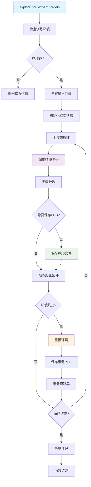

# `explore_for_expert_targets` 函数详细分析

## 函数概述

`explore_for_expert_targets` 是SAC强化学习算法中的一个关键函数，用于在正式训练前进行专家目标探索。该函数通过随机动作探索PCB布局空间，收集性能指标数据，并为后续训练提供参考基准。

## 函数签名

```python
def explore_for_expert_targets(self,
                               reward_target_exploration_steps=25_000,
                               output_dir=None,
                               save_pcb_every_n_steps=1000):
```

## 参数说明

| 参数名 | 类型 | 默认值 | 说明 |
|--------|------|--------|------|
| `reward_target_exploration_steps` | int | 25,000 | 总探索步数 |
| `output_dir` | str | None | PCB文件输出目录，None表示不保存 |
| `save_pcb_every_n_steps` | int | 1,000 | 每隔多少步保存一次PCB文件 |

## 返回值

- **类型**: `None`
- **说明**: 该函数不返回任何值，仅执行探索过程

## 函数调用关系图



## 详细调用分析

### 1. 环境检查调用

```python
if self.train_env is None:
    print("Model cannot explore because training envrionment is missing...")
    return
```

**调用说明**: 检查类的训练环境属性是否存在

### 2. 目录创建调用

```python
import os
from pathlib import Path
pcb_output_dir = os.path.join(output_dir, "explore_pcb")
Path(pcb_output_dir).mkdir(parents=True, exist_ok=True)
```

**调用文件**: 
- `os` - Python标准库
- `pathlib.Path` - Python标准库

**功能**: 创建PCB文件输出目录结构

### 3. 环境步进调用

```python
obs_vec = self.train_env.step(self.policy,
                              random=True,
                              rl_model_type="SAC")
```

**调用文件**: `src/training/core/environment/environment.py`

**调用函数**: `environment.step()`

**参数分析**:
- `self.policy`: 策略网络对象，用于获取动作空间信息
- `random=True`: 强制使用随机动作进行探索
- `rl_model_type="SAC"`: 指定强化学习算法类型

**返回值**: `obs_vec` - 观察向量列表，包含所有智能体的状态信息

**数据结构**: 
```python
obs_vec = [
    [state, next_state, reward, action, done, info],  # 智能体1
    [state, next_state, reward, action, done, info],  # 智能体2
    # ... 更多智能体
]
```

### 4. PCB文件保存调用

```python
self.train_env.write_current_pcb_file(
    path=pcb_output_dir,
    filename=filename
)
```

**调用文件**: `src/training/core/environment/environment.py`

**调用函数**: `environment.write_current_pcb_file()`

**功能**: 将当前PCB布局状态写入.pcb文件

**文件命名规则**:
- 定期保存: `explore_step_{step_count}.pcb`
- 重置保存: `explore_reset_{step_count}.pcb`

### 5. 环境重置调用

```python
self.train_env.reset()
```

**调用文件**: `src/training/core/environment/environment.py`

**调用函数**: `environment.reset()`

**功能**: 重置所有智能体状态，开始新的探索回合

**重置时机**:
- 当任何智能体达到终止条件时
- 探索循环结束后

### 6. 跟踪器重置调用

```python
self.train_env.tracker.reset()
```

**调用文件**: `src/training/core/environment/tracker.py`

**调用函数**: `tracker.reset()`

**功能**: 清空跟踪器中的历史数据，包括组件网格、飞线图、奖励、指标等

## 数据流分析

### 输入数据流

1. **环境状态**: 通过`self.train_env`获取当前PCB环境状态
2. **策略网络**: 通过`self.policy`获取动作空间信息
3. **配置参数**: 通过函数参数控制探索行为

### 输出数据流

1. **PCB文件**: 定期保存的布局状态文件
2. **控制台输出**: 保存状态和错误信息的日志
3. **环境状态**: 修改后的环境状态（通过重置）

### 内部状态变化

1. **步数计数**: `step_count`从0递增到`reward_target_exploration_steps`
2. **终止标志**: `self.done`在环境重置时变化
3. **目录结构**: 在指定位置创建`explore_pcb`子目录

## 异常处理机制

### 1. 环境缺失检查

```python
if self.train_env is None:
    print("Model cannot explore because training envrionment is missing...")
    return
```

**处理方式**: 早期返回，避免后续操作失败

### 2. 文件保存异常处理

```python
try:
    self.train_env.write_current_pcb_file(...)
    print(f"💾 已保存探索PCB文件: {filename}")
except Exception as e:
    print(f"保存PCB文件时出错: {e}")
```

**处理方式**: 捕获异常并记录错误信息，不影响探索过程继续

## 性能考虑

### 1. 内存管理

- 使用`step_count`计数器避免无限循环
- 定期重置环境状态，防止内存累积
- 跟踪器重置清空历史数据

### 2. 文件I/O优化

- 仅在需要时创建目录
- 批量保存PCB文件，减少频繁I/O操作
- 异常处理确保文件操作失败不影响主流程

### 3. 计算效率

- 随机动作选择，避免复杂的策略计算
- 简单的终止条件检查
- 最小化的状态更新操作

## 使用场景

### 1. 训练前准备

- 收集基准性能数据
- 建立专家目标参考
- 验证环境配置正确性

### 2. 数据收集

- 生成多样化的布局样本
- 建立性能分布统计
- 为后续分析提供数据基础

### 3. 调试验证

- 检查环境交互逻辑
- 验证文件保存功能
- 监控系统稳定性

## 扩展建议

### 1. 功能增强

- 添加探索进度显示
- 支持自定义保存策略
- 增加性能指标统计

### 2. 错误处理

- 更详细的异常分类
- 重试机制实现
- 日志文件记录

### 3. 性能优化

- 异步文件保存
- 批量数据处理
- 内存使用监控

## 总结

`explore_for_expert_targets`函数是一个设计良好的探索函数，它通过清晰的调用层次和异常处理机制，实现了PCB布局空间的随机探索。该函数的主要价值在于为强化学习训练提供数据基础，同时通过文件保存功能为后续分析提供支持。

函数的核心调用链为：**SAC类** → **Environment环境** → **Tracker跟踪器**，形成了一个完整的探索-记录-保存的数据流。这种设计使得函数具有良好的可维护性和扩展性。
