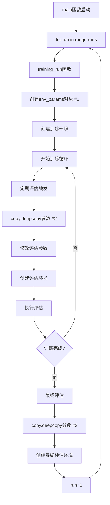

# train.py中parameters类初始化分析

## 概述

在强化学习PCB训练系统中，`parameters`类的初始化是环境配置的关键步骤。通过分析代码，我发现`parameters`类在训练过程中确实会被**多次初始化**，这是有其特定原因和目的的。

## parameters类的作用

### 核心功能
`parameters`类是环境参数的容器类，负责：
1. **存储环境配置**: 包含PCB文件路径、奖励权重、随机种子等关键参数
2. **参数传递**: 在不同组件间传递配置信息
3. **环境隔离**: 为不同的训练运行和评估创建独立的参数空间

### 参数内容
```python
class parameters:
    def __init__(self, params=None):
        self.training_pcb = params["training_pcb"]        # 训练PCB文件
        self.evaluation_pcb = params["evaluation_pcb"]    # 评估PCB文件
        self.pcb_file = params["pcb_file"]               # 当前使用的PCB文件
        self.w = params["w"]                             # 欧氏距离权重
        self.hpwl = params["hpwl"]                       # 半周长线长权重
        self.o = params["o"]                             # 重叠惩罚权重
        self.seed = params["seed"]                       # 随机种子
        self.max_steps = params["max_steps"]             # 最大步数
        # ... 其他参数
```

## 多次初始化的执行流程

### 1. 主训练初始化 (training_run函数中)

**位置**: `src/training/train.py` 第81行
```python
def training_run(settings):
    # ... 前置设置 ...
    
    env_params = parameters({
        "pcb_file": settings["training_pcb"],
        "training_pcb": settings["training_pcb"],
        "evaluation_pcb": settings["evaluation_pcb"],
        "net": "",
        "use_dataAugmenter": True,
        "augment_position": True,
        "augment_orientation": True,
        "agent_max_action": 1,
        "agent_expl_noise": hp["expl_noise"],
        "debug": False,
        "max_steps": 200,
        "w": settings["w"],
        "o": settings["o"],
        "hpwl": settings["hpwl"],
        "seed": settings["seed"][settings["run"]],  # 注意：每次运行使用不同种子
        "ignore_power": True,
        "log_dir": settings["log_dir"],
        "idx": settings["pcb_idx"],
        "shuffle_idxs": settings["shuffle_training_idxs"],
    })
    
    env = environment(env_params)  # 创建训练环境
```

**执行时机**: 每次训练运行开始时
**执行次数**: 等于`--runs`参数的值（默认1次）

### 2. 评估时的参数复制和修改 (callbacks.py中)

**位置**: `src/training/callbacks.py` 第372行
```python
def _eval(self, model=None, periodic=False, training_dataset=False, long=False):
    # ... 评估逻辑 ...
    
    # 复制训练环境的参数
    params = copy.deepcopy(self.model.train_env.get_parameters())
    
    # 修改参数用于评估
    params.debug = True
    params.shuffle_idxs = self.shuffle_evaluation_idxs
    params.seed = 3142  # 固定评估种子
    params.log_dir = None
    params.idx = -1
    
    if long is True:
        params.max_steps *= 3  # 延长评估步数
        
    if training_dataset is True:
        params.pcb_file = params.training_pcb
    else:
        params.pcb_file = params.evaluation_pcb  # 切换到评估PCB
```

**执行时机**: 
- 定期评估时(`--evaluate_every`间隔)
- 训练结束后的最终评估
- 专家目标探索时

**执行次数**: 训练过程中多次（取决于评估频率）

## 为什么需要执行多次初始化

### 1. **多运行隔离**
```python
for run in range(settings["runs"]):
    settings["run"] = run
    perf_metrics = training_run(settings=settings)  # 每次运行创建新的参数对象
```

**原因**:
- 每次运行使用不同的随机种子: `settings["seed"][settings["run"]]`
- 创建独立的日志目录: `settings["run_name"] + f'_{settings["run"]}'`
- 避免运行间的状态污染

**好处**:
- 确保实验结果的独立性
- 支持统计性分析（多次运行的平均值）
- 便于并行化改造（注释中提到的多线程优化）

### 2. **训练与评估环境分离**
```python
# 训练参数
train_params.pcb_file = settings["training_pcb"]
train_params.shuffle_idxs = settings["shuffle_training_idxs"]
train_params.debug = False

# 评估参数 (从训练参数复制后修改)
eval_params.pcb_file = settings["evaluation_pcb"]  # 使用不同的PCB文件
eval_params.shuffle_idxs = self.shuffle_evaluation_idxs
eval_params.debug = True
eval_params.seed = 3142  # 固定种子确保评估一致性
```

**原因**:
- **数据集切换**: 训练用training.pcb，评估用evaluation.pcb
- **行为差异**: 训练时需要探索，评估时需要确定性
- **调试需求**: 评估时开启调试模式获取详细信息

### 3. **动态参数调整**
```python
if long is True:
    params.max_steps *= 3  # 长评估模式

if training_dataset is True:
    params.pcb_file = params.training_pcb  # 在训练集上评估
else:
    params.pcb_file = params.evaluation_pcb  # 在测试集上评估
```

**原因**:
- 支持不同评估模式（短评估vs长评估）
- 支持在不同数据集上评估性能
- 动态调整环境参数满足不同需求

## 初始化的技术细节

### 1. 深拷贝机制
```python
params = copy.deepcopy(self.model.train_env.get_parameters())
```
- 使用深拷贝避免修改原始参数对象
- 确保训练环境参数不被评估过程影响
- 提供参数隔离和安全性

### 2. 种子管理策略
```python
# 训练时: 每次运行使用不同种子
"seed": settings["seed"][settings["run"]]

# 评估时: 使用固定种子确保一致性
params.seed = 3142
```

### 3. 文件路径动态切换
```python
# 训练阶段
"pcb_file": settings["training_pcb"]

# 评估阶段
params.pcb_file = params.evaluation_pcb  # 或 params.training_pcb
```

## 执行时序图



## 性能影响分析

### 1. 内存开销
- 每个`parameters`对象占用内存较小（主要是配置信息）
- 深拷贝操作成本相对较低
- 对整体性能影响微乎其微

### 2. 执行效率
- 参数初始化时间可忽略不计
- 环境创建是主要开销（PCB文件加载、图结构构建）
- 多次初始化不影响训练效率

### 3. 设计权衡
- **优势**: 清晰的参数隔离、灵活的配置管理
- **代价**: 轻微的内存和计算开销
- **结论**: 设计优势远大于性能代价

## 最佳实践建议

### 1. 参数管理
```python
# 推荐: 明确区分训练和评估参数
train_params = create_training_params(settings)
eval_params = create_evaluation_params(train_params)
```

### 2. 资源优化
```python
# 可选: 参数对象复用（需要careful状态管理）
def reset_params_for_evaluation(params):
    params.debug = True
    params.seed = 3142
    return params
```

### 3. 调试支持
```python
# 建议: 记录参数变化用于调试
def log_params_change(old_params, new_params):
    differences = find_param_differences(old_params, new_params)
    logging.info(f"Parameter changes: {differences}")
```

## 总结

`parameters`类在`train.py`中的多次初始化是一个精心设计的特性，主要目的是：

1. **实验隔离**: 为多次运行提供独立的参数空间
2. **功能分离**: 区分训练环境和评估环境的不同需求
3. **灵活配置**: 支持动态参数调整和不同评估模式

这种设计模式确保了实验的可重现性、结果的可靠性，以及系统的可扩展性。虽然涉及多次对象创建，但由于参数对象相对轻量，对整体性能的影响微乎其微，是一个合理的工程权衡。
