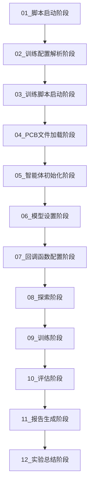

# PCB布局优化强化学习训练流程解析

## 概述

本文件夹包含了基于`run.sh`脚本的PCB布局优化强化学习训练流程的详细解析文档。每个文档对应训练流程中的一个关键阶段，提供了深入的技术分析和实现细节。

## 训练流程总览



## 文档结构

### 1. 初始化阶段 (01-03)
- **[01_脚本启动阶段](./01_脚本启动阶段.md)** - 系统资源检测、环境配置、调度器启动
- **[02_训练配置解析阶段](./02_训练配置解析阶段.md)** - 参数组合分析、配置解析
- **[03_训练脚本启动阶段](./03_训练脚本启动阶段.md)** - 参数解析、环境设置、训练初始化

### 2. 数据加载阶段 (04-05)
- **[04_PCB文件加载阶段](./04_PCB文件加载阶段.md)** - PCB文件解析、数据结构构建
- **[05_智能体初始化阶段](./05_智能体初始化阶段.md)** - 智能体创建、动作空间设置、奖励函数配置

### 3. 模型配置阶段 (06-07)
- **[06_模型设置阶段](./06_模型设置阶段.md)** - SAC/TD3算法配置、神经网络架构
- **[07_回调函数配置阶段](./07_回调函数配置阶段.md)** - 监控、评估、日志记录配置

### 4. 训练执行阶段 (08-09)
- **[08_探索阶段](./08_探索阶段.md)** - 随机探索、经验收集、初始策略学习
- **[09_训练阶段](./09_训练阶段.md)** - 强化学习训练、网络更新、策略优化

### 5. 评估分析阶段 (10-12)
- **[10_评估阶段](./10_评估阶段.md)** - 模型性能测试、指标计算、结果分析
- **[11_报告生成阶段](./11_报告生成阶段.md)** - 综合报告生成、可视化、PDF输出
- **[12_实验总结阶段](./12_实验总结阶段.md)** - 结果总结、改进建议、未来规划

## 关键技术要点

### PCB文件格式
```
filename=./05_3_multi_agent_no_power_0.pcb
timestamp=1659266776
pcb begin
    .kicad_pcb=bistable_oscillator_with_555_timer_and_ldo_2lyr_setup_00.kicad_pcb
    timestamp=1659266776
    id=0
    graph begin
        nodes begin
            0,C3,3.30000000,1.46000000,116.30000000,94.20000000,0.00000000,0,0,2,2,0,-1
            # ... 更多节点
        nodes end
        edges begin
            # ... 连接信息
        edges end
    graph end
    board begin
        bb_min_x,100.00000000
        bb_min_y,80.00000000
        bb_max_x,120.00000000
        bb_max_y,100.00000000
    board end
pcb end
```

### 强化学习算法
- **SAC (Soft Actor-Critic)**: 适用于连续动作空间，具有熵正则化
- **TD3 (Twin Delayed Deep Deterministic Policy Gradient)**: 双Q网络，延迟策略更新

### 奖励函数设计
```python
reward = w * euclidean_distance + hpwl * hpwl_score + o * overlap_penalty
```

### 训练参数配置
```bash
--policy SAC                    # 算法选择
--max_timesteps 600_000        # 最大训练步数
--training_pcb training.pcb    # 训练PCB文件
--evaluation_pcb evaluation.pcb # 评估PCB文件
-w 6.0 --hpwl 2.0 -o 2.0     # 奖励权重
```

## 实验配置示例

### 参数组合实验
| 实验 | w值 | hpwl值 | o值 | 说明 |
|------|-----|--------|-----|------|
| 622  | 6.0 | 2.0    | 2.0 | 高欧几里得距离权重 |
| 262  | 2.0 | 6.0    | 2.0 | 高HPWL权重 |
| 226  | 2.0 | 2.0    | 6.0 | 高重叠惩罚权重 |
| 442  | 4.0 | 4.0    | 2.0 | 平衡权重配置 |

## 性能指标

### 训练指标
- **收敛性**: 训练是否收敛到稳定策略
- **奖励趋势**: 平均奖励随时间的变化
- **损失稳定性**: 策略损失和价值损失的稳定性

### 评估指标
- **成功率**: 满足约束条件的布局比例
- **线长优化**: 总连接线长的最小化
- **HPWL**: Half-Perimeter Wirelength优化
- **重叠惩罚**: 组件间重叠面积的惩罚

## 输出文件结构

```
experiments/00_parameter_exeperiments/
├── work/                          # 工作目录
│   ├── models/                    # 模型检查点
│   ├── evaluation/                # 评估结果
│   ├── realtime_pcb/             # 实时PCB文件
│   ├── tensorboard/              # TensorBoard日志
│   └── training.log              # 训练日志
├── hyperparameters/               # 超参数配置
│   ├── hp_sac.json              # SAC超参数
│   └── hp_td3.json              # TD3超参数
├── run_config.txt                # 训练配置
├── run.sh                        # 启动脚本
└── experiment_report.pdf         # 实验报告
```

## 使用说明

1. **环境准备**: 确保Python环境和依赖库已正确安装
2. **数据准备**: 将PCB文件放置在`dataset/base/`目录下
3. **配置调整**: 根据需要修改`run_config.txt`中的参数
4. **执行训练**: 运行`./run.sh`启动训练流程
5. **监控进度**: 通过TensorBoard监控训练进度
6. **查看结果**: 查看生成的报告和可视化结果

## 注意事项

- 确保有足够的GPU内存进行训练
- 根据硬件配置调整并行实例数
- 定期备份重要的模型检查点
- 监控训练过程中的资源使用情况

## 故障排除

### 常见问题
1. **内存不足**: 减少批次大小或并行实例数
2. **训练不收敛**: 调整学习率或奖励权重
3. **GPU错误**: 检查CUDA版本兼容性
4. **文件路径错误**: 确保所有路径配置正确

### 调试技巧
- 使用`--verbose 1`启用详细输出
- 检查TensorBoard日志分析训练趋势
- 对比不同参数组合的评估结果
- 分析PCB文件格式确保数据正确

## 扩展功能

### 自定义奖励函数
```python
def custom_reward_function(state, action, next_state):
    # 实现自定义奖励逻辑
    return reward
```

### 新算法集成
```python
def setup_custom_model(model_type, env, hyperparameters):
    # 集成新的强化学习算法
    return model
```

### 数据增强
```python
def augment_pcb_data(pcb_file):
    # 实现PCB数据增强
    return augmented_data
```

## 贡献指南

欢迎提交改进建议和bug报告。请确保：
- 代码符合项目规范
- 添加适当的文档和注释
- 通过所有测试用例
- 更新相关文档

## 许可证

本项目采用MIT许可证，详见LICENSE文件。

---

**最后更新**: 2024年12月
**版本**: 1.0.0
**维护者**: RL_PCB开发团队 